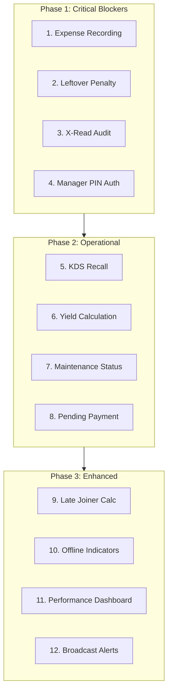

# WTFPOS Feature Implementation Plan

## Overview

This plan addresses 12 critical missing features identified in the ASSESSMENT_USER_SCENARIOS.md analysis. The features are organized by priority and dependency.

---

## Features to Implement

### 🔴 Critical Priority (Business Blockers)

#### 1. Expense Recording Module
**Current State:** Phase 3 placeholder only ([`expenses/+page.svelte`](src/routes/expenses/+page.svelte:1))
**Required Functionality:**
- Record operational expenses (supplies, repairs, utilities, etc.)
- Categorize expenses with predefined categories
- Attach receipts (file upload simulation)
- Link expenses to specific shifts/cashiers
- Deduct from cash drawer calculations
- Expense reports by category and date range

**Implementation:**
- Add [`Expense`](src/lib/types.ts:1) type with fields: id, category, amount, description, receiptUrl, createdBy, createdAt, locationId
- Create expense store in [`stores/expenses.svelte.ts`](src/lib/stores/expenses.svelte.ts:1)
- Build full expenses UI in [`expenses/+page.svelte`](src/routes/expenses/+page.svelte:1)
- Integrate with EOD cash reconciliation

#### 2. Leftover/Waste Penalty Charge System
**Current State:** Not implemented
**Required Functionality:**
- Track leftover food weight at end of meal
- Calculate penalty based on package rules (e.g., >200g leftover = ₱100 charge)
- Add penalty as line item to order before checkout
- Manager override for legitimate cases

**Implementation:**
- Add [`leftoverPenalty`](src/lib/types.ts:100) field to Order type
- Create [`LeftoverPenaltyModal.svelte`](src/lib/components/pos/LeftoverPenaltyModal.svelte:1)
- Add penalty calculation logic to [`pos.svelte.ts`](src/lib/stores/pos.svelte.ts:1)
- Display penalty in [`CheckoutModal.svelte`](src/lib/components/pos/CheckoutModal.svelte:1)

#### 3. X-Read Mid-Shift Audit
**Current State:** Only EOD (Z-Read) exists
**Required Functionality:**
- Generate mid-shift audit report without closing shift
- Show current cash position vs expected
- Track voids/discounts since shift start
- Print X-Read receipt
- Multiple X-Reads per shift allowed

**Implementation:**
- Create [`x-read/+page.svelte`](src/routes/reports/x-read/+page.svelte:1)
- Add X-Read generation function to [`reports.svelte.ts`](src/lib/stores/reports.svelte.ts:1)
- Add navigation link in reports layout

#### 4. Manager PIN Authorization for Comp/Void
**Current State:** Hardcoded PIN "1234" in [`VoidModal.svelte`](src/lib/components/pos/VoidModal.svelte:16)
**Required Functionality:**
- Per-user PIN configuration in user management
- PIN verification for comp discounts
- PIN verification for voids
- Audit log of PIN usage

**Implementation:**
- Add `pin` field to UserRecord type
- Update user creation/edit modal to set PIN
- Create [`PinAuthModal.svelte`](src/lib/components/pos/PinAuthModal.svelte:1) reusable component
- Modify [`VoidModal.svelte`](src/lib/components/pos/VoidModal.svelte:1) to use user PINs
- Add PIN check to comp discount in [`CheckoutModal.svelte`](src/lib/components/pos/CheckoutModal.svelte:1)

---

### 🟠 High Priority (Operational Efficiency)

#### 5. KDS Recall/History for Bumped Tickets
**Current State:** Tickets disappear when all items served
**Required Functionality:**
- Store completed tickets for shift duration
- "Recall Last" button for accidentally bumped tickets
- History view with timestamps
- Filter by table number or time

**Implementation:**
- Add [`kdsTicketHistory`](src/lib/stores/pos.svelte.ts:93) array to store completed tickets
- Create [`KdsHistoryModal.svelte`](src/lib/components/kitchen/KdsHistoryModal.svelte:1)
- Add Recall button to [`kitchen/orders/+page.svelte`](src/routes/kitchen/orders/+page.svelte:1)
- Implement recall function to restore ticket

#### 6. Yield Percentage Calculation for Butchering
**Current State:** Weigh station exists but no yield calculation
**Required Functionality:**
- Input raw weight received
- Track trimmed/cleaned weight
- Calculate and display yield percentage
- Alert if yield below threshold (e.g., <70%)
- Log yield data for supplier quality tracking

**Implementation:**
- Add [`YieldEntry`](src/lib/types.ts:1) type
- Update [`weigh-station/+page.svelte`](src/routes/kitchen/weigh-station/+page.svelte:1) with yield calc UI
- Add yield tracking to stock store
- Display yield trends in reports

#### 7. Table "Out of Order" / Maintenance Status
**Current State:** Table statuses: available, occupied, warning, critical, billing
**Required Functionality:**
- Add 'maintenance' status to [`TableStatus`](src/lib/types.ts:4)
- Prevent seating at maintenance tables
- Visual indicator (wrench icon, gray color)
- Manager override to set/clear status

**Implementation:**
- Update [`types.ts`](src/lib/types.ts:4) TableStatus type
- Modify [`FloorPlan.svelte`](src/lib/components/pos/FloorPlan.svelte:1) to show maintenance state
- Add context menu to tables for setting maintenance
- Update table card styling

#### 8. Pending Payment Hold State
**Current State:** Orders go directly from open to paid
**Required Functionality:**
- Add 'pending_payment' status to Order
- Hold order while waiting for GCash SMS confirmation
- Visual indicator in takeout lane
- Auto-timeout after X minutes
- Retry or cancel options

**Implementation:**
- Update [`Order.status`](src/lib/types.ts:111) type
- Modify [`CheckoutModal.svelte`](src/lib/components/pos/CheckoutModal.svelte:1) for pending state
- Update [`TakeoutQueue.svelte`](src/lib/components/pos/TakeoutQueue.svelte:1) to show pending
- Add timeout handling

---

### 🟡 Medium Priority (Enhanced Experience)

#### 9. Late Joiner Pax Auto-Calculation
**Current State:** Can change pax but doesn't auto-calculate charges
**Required Functionality:**
- Detect pax increase during active session
- Calculate additional package charges for new pax
- Pro-rate if joining late in session
- Show breakdown of original vs additional charges

**Implementation:**
- Modify [`PaxModal.svelte`](src/lib/components/pos/PaxModal.svelte:1) with late joiner logic
- Add `originalPax` and `paxChangeHistory` to Order type
- Calculate prorated charges based on remaining time
- Display in order sidebar

#### 10. Offline Mode Indicators
**Current State:** No explicit offline detection
**Required Functionality:**
- Network connectivity monitoring
- Visual indicator when offline (banner/icon)
- Queue actions for sync when back online
- Warn users of limited functionality

**Implementation:**
- Create [`connection.svelte.ts`](src/lib/stores/connection.svelte.ts:1) store
- Add navigator.onLine monitoring
- Create [`OfflineIndicator.svelte`](src/lib/components/OfflineIndicator.svelte:1)
- Show in [`+layout.svelte`](src/routes/+layout.svelte:1)
- Add offline-aware behavior to critical actions

#### 11. Performance Metrics Dashboard
**Current State:** Basic audit log exists
**Required Functionality:**
- Individual staff metrics (orders processed, voids, discounts given)
- Void rate analysis by staff
- Average order value by staff
- Time-to-checkout metrics
- Comparison charts

**Implementation:**
- Create [`staff-performance/+page.svelte`](src/routes/reports/staff-performance/+page.svelte:1)
- Add aggregation functions to [`reports.svelte.ts`](src/lib/stores/reports.svelte.ts:1)
- Calculate metrics from audit log data
- Add charts/visualizations

#### 12. Broadcast Alert System for Kitchen Refusals
**Current State:** No alert system
**Required Functionality:**
- Kitchen can mark items as "refused" (quality issues)
- Broadcast alert to all POS stations
- Visual/audible notification
- Alert acknowledgment required
- Log refusal reasons

**Implementation:**
- Add [`KitchenAlert`](src/lib/types.ts:1) type
- Create [`alert.svelte.ts`](src/lib/stores/alert.svelte.ts:1) store
- Build [`AlertBanner.svelte`](src/lib/components/AlertBanner.svelte:1) component
- Add refusal button to KDS
- Integrate with [`+layout.svelte`](src/routes/+layout.svelte:1)

---

## Implementation Order



---

## File Structure Changes

### New Files to Create

```
src/
├── lib/
│   ├── stores/
│   │   ├── expenses.svelte.ts        # Expense tracking
│   │   ├── connection.svelte.ts      # Online/offline state
│   │   └── alert.svelte.ts           # Broadcast alerts
│   ├── components/
│   │   ├── pos/
│   │   │   ├── LeftoverPenaltyModal.svelte
│   │   │   ├── PinAuthModal.svelte
│   │   │   └── PendingPaymentBadge.svelte
│   │   ├── kitchen/
│   │   │   └── KdsHistoryModal.svelte
│   │   ├── OfflineIndicator.svelte
│   │   └── AlertBanner.svelte
│   └── types.ts                      # Add new types
├── routes/
│   ├── expenses/
│   │   └── +page.svelte              # Full implementation
│   ├── reports/
│   │   ├── x-read/
│   │   │   └── +page.svelte          # New report
│   │   └── staff-performance/
│   │       └── +page.svelte          # New report
│   └── kitchen/
│       └── weigh-station/
│           └── +page.svelte          # Update with yield
```

### Files to Modify

```
src/
├── lib/
│   ├── types.ts                      # Add Expense, YieldEntry, KitchenAlert types
│   ├── stores/
│   │   ├── pos.svelte.ts             # Add penalty, recall, maintenance functions
│   │   ├── reports.svelte.ts         # Add X-Read, performance aggregations
│   │   └── audit.svelte.ts           # Add PIN audit logging
│   └── components/
│       ├── pos/
│       │   ├── VoidModal.svelte      # Use PinAuthModal
│       │   ├── CheckoutModal.svelte  # Add PIN for comp, penalty display
│       │   ├── FloorPlan.svelte      # Add maintenance status
│       │   ├── TakeoutQueue.svelte   # Add pending status
│       │   └── PaxModal.svelte       # Add late joiner logic
│       └── kitchen/
│           └── orders/
│               └── +page.svelte      # Add recall, refusal buttons
├── routes/
│   ├── admin/
│   │   └── users/
│   │       └── +page.svelte          # Add PIN field to users
│   └── reports/
│       └── eod/
│           └── +page.svelte          # Integrate expenses
```

---

## Type Definitions

### New Types to Add to [`types.ts`](src/lib/types.ts:1)

```typescript
// Expense Types
export type ExpenseCategory = 'supplies' | 'repairs' | 'utilities' | 'miscellaneous';

export interface Expense {
    id: string;
    locationId: string;
    category: ExpenseCategory;
    amount: number;
    description: string;
    receiptUrl?: string;
    createdBy: string;
    createdAt: string;
    shiftId?: string;
}

// Extended Table Status
export type TableStatus = 'available' | 'occupied' | 'warning' | 'critical' | 'billing' | 'maintenance';

// Yield Tracking
export interface YieldEntry {
    id: string;
    stockItemId: string;
    rawWeight: number;
    cleanedWeight: number;
    yieldPercent: number;
    supplier: string;
    loggedAt: string;
    loggedBy: string;
}

// Kitchen Alerts
export interface KitchenAlert {
    id: string;
    type: 'refusal' | 'quality_issue' | 'delay_warning';
    message: string;
    tableNumber?: number;
    orderId?: string;
    createdAt: string;
    acknowledged: boolean;
    acknowledgedBy?: string;
}

// Extended Order for Penalty and Pax History
export interface Order {
    // ... existing fields
    leftoverPenalty?: number;
    originalPax?: number;
    paxChangeHistory?: PaxChangeEntry[];
}

export interface PaxChangeEntry {
    timestamp: string;
    fromPax: number;
    toPax: number;
    additionalCharge: number;
}
```

---

## Testing Checklist

### Expense Recording
- [ ] Can create expense with all fields
- [ ] Expenses deduct from EOD cash calculation
- [ ] Expenses filtered by location
- [ ] Receipt upload simulation works

### Leftover Penalty
- [ ] Penalty calculates based on weight input
- [ ] Penalty appears in checkout total
- [ ] Manager can waive penalty with PIN
- [ ] Audit log records penalty application

### X-Read
- [ ] X-Read generates without closing shift
- [ ] Shows accurate cash position
- [ ] Multiple X-Reads accumulate correctly
- [ ] Printed report format correct

### Manager PIN
- [ ] Users have individual PINs
- [ ] Comp discount requires PIN
- [ ] Void requires PIN
- [ ] Failed PIN attempts logged

### KDS Recall
- [ ] Bumped tickets saved to history
- [ ] Recall restores ticket to active
- [ ] History view searchable
- [ ] Old tickets auto-purge after shift

### Yield Calculation
- [ ] Yield % calculates correctly
- [ ] Alert shows for low yield
- [ ] Data saves to stock records
- [ ] Trend visible in reports

### Maintenance Status
- [ ] Tables can be marked maintenance
- [ ] Cannot seat at maintenance tables
- [ ] Visual indicator shows correctly
- [ ] Status persists across sessions

### Pending Payment
- [ ] Orders can be set to pending
- [ ] Visual indicator in queue
- [ ] Auto-timeout after period
- [ ] Can complete or cancel pending

### Late Joiner
- [ ] Pax increase detected
- [ ] Additional charge calculated
- [ ] Proration based on remaining time
- [ ] Charge breakdown visible

### Offline Mode
- [ ] Indicator shows when offline
- [ ] Critical actions blocked appropriately
- [ ] Actions queue for sync
- [ ] Reconnection detected

### Performance Dashboard
- [ ] Metrics calculate correctly
- [ ] Staff comparison works
- [ ] Date range filtering
- [ ] Export functionality

### Broadcast Alerts
- [ ] Kitchen can send alerts
- [ ] Alert appears on all stations
- [ ] Acknowledgment required
- [ ] Alerts logged in audit trail
