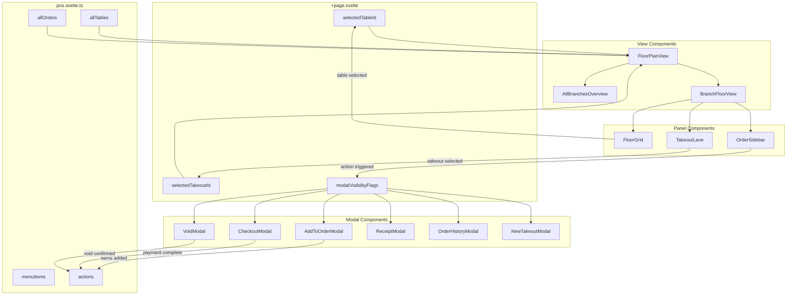

# POS Page Refactoring Plan

## Current State Analysis

The `src/routes/pos/+page.svelte` file is **~64KB** (~1550 lines) and contains:
- 420 lines of script (state management, helpers, handlers)
- 9 major UI sections/modals inline in the template
- Only 3 modals already extracted to components

### Current Structure

```
pos/+page.svelte (1550 lines)
├── Script Section (lines 1-420)
│   ├── Imports
│   ├── Derived state (tables, orders, takeoutOrders)
│   ├── Table/takeout selection state
│   ├── Checkout modal state
│   ├── Receipt modal state
│   ├── Void flow state
│   ├── Transfer/Package/Split modal state (uses external components)
│   ├── Order history state
│   ├── New takeout modal state
│   └── Add to order modal state + helpers
│
├── Template Section (lines 420-1546)
│   ├── TopBar
│   ├── All Branches Overview (inline, lines 422-520)
│   ├── Main POS Layout (inline, lines 520-830)
│   │   ├── Floor Plan (table grid)
│   │   ├── Takeout Lane
│   │   └── Order Sidebar
│   ├── Add to Order Modal (inline, lines 831-1026)
│   ├── Checkout Modal (inline, lines 1027-1242)
│   ├── Receipt Modal (inline, lines 1243-1333)
│   ├── Void Confirmation Modal (inline, lines 1334-1422)
│   ├── Order History Modal (inline, lines 1423-1519)
│   ├── TransferTableModal (external component)
│   ├── PackageChangeModal (external component)
│   └── SplitBillModal (external component)
```

---

## Target Architecture

### Component Hierarchy

```
pos/+page.svelte (~200 lines)
├── Script: Orchestration only (selection state, modal visibility)
├── TopBar
├── FloorPlanView
│   ├── AllBranchesOverview (when session.locationId === 'all')
│   └── BranchFloorView (normal branch view)
│       ├── FloorGrid
│       ├── TakeoutLane
│       └── OrderSidebar
│
├── Modals (all external)
│   ├── AddToOrderModal
│   ├── CheckoutModal
│   ├── ReceiptModal
│   ├── VoidModal
│   ├── OrderHistoryModal
│   ├── NewTakeoutModal
│   ├── TransferTableModal (exists)
│   ├── PackageChangeModal (exists)
│   └── SplitBillModal (exists)
```

---

## Component Breakdown

### 1. FloorPlanView Component
**File:** `src/lib/components/pos/FloorPlanView.svelte`
**Responsibility:** Main layout container, branch switching logic
**Props:**
```typescript
interface Props {
  tables: Table[];
  orders: Order[];
  selectedTableId: string | null;
  selectedTakeoutId: string | null;
  onTableSelect: (table: Table) => void;
  onTakeoutSelect: (order: Order) => void;
  onNewTakeout: () => void;
}
```

### 2. AllBranchesOverview Component
**File:** `src/lib/components/pos/AllBranchesOverview.svelte`
**Responsibility:** Multi-branch dashboard view
**Props:**
```typescript
interface Props {
  tables: Table[];
  orders: Order[];
}
```

### 3. BranchFloorView Component
**File:** `src/lib/components/pos/BranchFloorView.svelte`
**Responsibility:** Single branch layout with floor + sidebar
**Props:**
```typescript
interface Props {
  tables: Table[];
  orders: Order[];
  takeoutOrders: Order[];
  selectedTableId: string | null;
  selectedTakeoutId: string | null;
  currentActiveOrder: Order | undefined;
  onTableSelect: (table: Table) => void;
  onTakeoutSelect: (order: Order) => void;
  onNewTakeout: () => void;
  // Action handlers passed through to sidebar
  onAddItem: () => void;
  onCheckout: () => void;
  onVoid: () => void;
  onPrint: () => void;
  onTransfer: () => void;
  onPackageChange: () => void;
  onSplitBill: () => void;
  onViewHistory: () => void;
}
```

### 4. FloorGrid Component
**File:** `src/lib/components/pos/FloorGrid.svelte`
**Responsibility:** Render table cards in grid layout
**Props:**
```typescript
interface Props {
  tables: Table[];
  orders: Order[];
  selectedTableId: string | null;
  onTableSelect: (table: Table) => void;
}
```

### 5. TakeoutLane Component
**File:** `src/lib/components/pos/TakeoutLane.svelte`
**Responsibility:** Takeout orders list with status lanes
**Props:**
```typescript
interface Props {
  takeoutOrders: Order[];
  selectedTakeoutId: string | null;
  onTakeoutSelect: (order: Order) => void;
  onNewTakeout: () => void;
}
```

### 6. OrderSidebar Component
**File:** `src/lib/components/pos/OrderSidebar.svelte`
**Responsibility:** Order details, items, actions panel
**Props:**
```typescript
interface Props {
  order: Order | undefined;
  table: Table | undefined;
  onClose: () => void;
  onAddItem: () => void;
  onCheckout: () => void;
  onVoid: () => void;
  onPrint: () => void;
  onTransfer: () => void;
  onPackageChange: () => void;
  onSplitBill: () => void;
  onViewHistory: () => void;
}
```

### 7. AddToOrderModal Component (NEW)
**File:** `src/lib/components/pos/AddToOrderModal.svelte`
**Responsibility:** Menu browsing, item selection, pending cart
**Props:**
```typescript
interface Props {
  isOpen: boolean;
  order: Order;
  onClose: () => void;
  onAdd: (items: PendingItem[]) => void;
}
```

### 8. CheckoutModal Component (NEW)
**File:** `src/lib/components/pos/CheckoutModal.svelte`
**Responsibility:** Payment method selection, cash tender, receipt printing
**Props:**
```typescript
interface Props {
  isOpen: boolean;
  order: Order;
  onClose: () => void;
  onComplete: (payment: PaymentDetails) => void;
  onSkipReceipt: () => void;
}
```

### 9. ReceiptModal Component (NEW)
**File:** `src/lib/components/pos/ReceiptModal.svelte`
**Responsibility:** Post-payment receipt display
**Props:**
```typescript
interface Props {
  isOpen: boolean;
  order: Order;
  change: number;
  method: string;
  onClose: () => void;
}
```

### 10. VoidModal Component (NEW)
**File:** `src/lib/components/pos/VoidModal.svelte`
**Responsibility:** PIN entry, reason selection for voids
**Props:**
```typescript
interface Props {
  isOpen: boolean;
  onClose: () => void;
  onConfirm: (reason: VoidReason, pin: string) => void;
}
```

### 11. OrderHistoryModal Component (NEW)
**File:** `src/lib/components/pos/OrderHistoryModal.svelte`
**Responsibility:** Closed/cancelled orders list
**Props:**
```typescript
interface Props {
  isOpen: boolean;
  orders: Order[];
  onClose: () => void;
  onViewOrder: (order: Order) => void;
}
```

### 12. NewTakeoutModal Component (NEW)
**File:** `src/lib/components/pos/NewTakeoutModal.svelte`
**Responsibility:** Simple modal for customer name entry
**Props:**
```typescript
interface Props {
  isOpen: boolean;
  onClose: () => void;
  onConfirm: (name: string) => void;
}
```

---

## State Management Strategy

### Global State (POS Store)
Keep in `pos.svelte.ts`:
- `allTables` - All table data
- `allOrders` - All order data
- `menuItems` - Menu catalog
- Actions: `openTable`, `closeTable`, `cleanTable`, `voidOrder`, etc.

### Page-Level State (in +page.svelte)
- `selectedTableId` / `selectedTakeoutId` - Current selection
- `session.locationId` - Current branch filter (from session store)
- Modal visibility flags: `showCheckout`, `showAddItem`, `showVoidConfirm`, etc.

### Component-Level State
Each modal/component manages its own:
- Form inputs
- Validation state
- Internal UI state (active tabs, etc.)

### Props Flow
```
+page.svelte (selection state, modal visibility)
    ↓
FloorPlanView (no state, layout only)
    ↓
BranchFloorView (receives handlers)
    ↓
├── FloorGrid (displays tables, emits selection)
├── TakeoutLane (displays takeouts, emits selection)
└── OrderSidebar (displays order, emits actions)
    ↓
Modals (receive order data, emit results)
```

---

## File Structure After Refactor

```
src/lib/components/pos/
├── FloorPlanView.svelte          # NEW - Main container
├── AllBranchesOverview.svelte    # NEW - Multi-branch view
├── BranchFloorView.svelte        # NEW - Single branch layout
├── FloorGrid.svelte              # NEW - Table grid
├── TakeoutLane.svelte            # NEW - Takeout orders
├── OrderSidebar.svelte           # NEW - Order details panel
├── AddToOrderModal.svelte        # NEW - Menu modal
├── CheckoutModal.svelte          # NEW - Payment modal
├── ReceiptModal.svelte           # NEW - Receipt display
├── VoidModal.svelte              # NEW - Void confirmation
├── OrderHistoryModal.svelte      # NEW - History list
├── NewTakeoutModal.svelte        # NEW - Takeout creation
├── TransferTableModal.svelte     # EXISTS
├── PackageChangeModal.svelte     # EXISTS
└── SplitBillModal.svelte         # EXISTS
```

---

## Refactoring Phases

### Phase 1: Extract Simple Modals (Low Risk)
1. Create `NewTakeoutModal.svelte` (simplest, ~30 lines)
2. Create `ReceiptModal.svelte` (display only)
3. Create `VoidModal.svelte` (PIN entry)
4. Create `OrderHistoryModal.svelte` (list display)
5. Update `+page.svelte` to use extracted components

**Estimated Lines Removed:** ~300

### Phase 2: Extract Complex Modals
1. Create `CheckoutModal.svelte` (payment logic)
2. Create `AddToOrderModal.svelte` (menu browsing, most complex)

**Estimated Lines Removed:** ~400

### Phase 3: Extract Layout Components
1. Create `OrderSidebar.svelte`
2. Create `TakeoutLane.svelte`
3. Create `FloorGrid.svelte`

**Estimated Lines Removed:** ~300

### Phase 4: Extract Container Components
1. Create `AllBranchesOverview.svelte`
2. Create `BranchFloorView.svelte`
3. Create `FloorPlanView.svelte`
4. Clean up `+page.svelte` to orchestration only

**Estimated Lines Removed:** ~400

### Final State
- `+page.svelte`: ~200 lines (down from 1550)
- New components: 12 files
- Existing extracted components: 3 files (already done)

---

## Data Flow Diagram



---

## Testing Strategy

After each phase:
1. Verify all table selection flows work
2. Verify takeout order flows work
3. Verify all modals open/close correctly
4. Verify checkout flow completes end-to-end
5. Verify void flow with PIN works
6. Verify split bill, transfer, package change still work

---

## Migration Checklist

- [ ] Phase 1: Simple modals extracted
- [ ] Phase 2: Complex modals extracted
- [ ] Phase 3: Layout components extracted
- [ ] Phase 4: Container components extracted
- [ ] Verify no functionality regression
- [ ] Update imports in +page.svelte
- [ ] Clean up unused code
- [ ] Test all user flows
