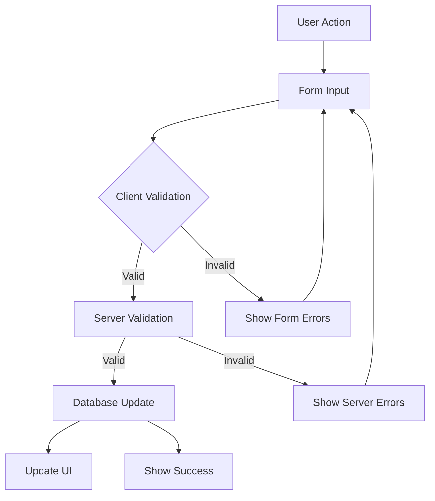

np# Rental_unit Management Module Instructions

## Overview

The Rental_unit Management module is a core component of the dormitory management system that handles rental_unit operations and tracking. It enables staff to create, update, and manage rental_unit across different properties and floors, including their status, capacity, and rates.

## Database Schema

### Rental_Units Table

```sql
CREATE TABLE public.rental_unit (
    id integer NOT NULL DEFAULT nextval('locations_id_seq'::regclass),
    name text NOT NULL,
    number integer NOT NULL,
    capacity integer NOT NULL,
    rental_unit_status location_status NOT NULL DEFAULT 'VACANT',
    base_rate numeric(10,2) NOT NULL,
    created_at timestamp with time zone NOT NULL DEFAULT timezone('utc'::text, now()),
    updated_at timestamp with time zone,
    property_id integer NOT NULL,
    floor_id integer NOT NULL,
    type text NOT NULL,
    amenities jsonb DEFAULT '{}'
);
```

### Related Tables

#### Properties Table (Reference)

```sql
CREATE TABLE public.properties (
    id integer NOT NULL DEFAULT nextval('properties_id_seq'::regclass),
    name text NOT NULL,
    address text NOT NULL,
    type text NOT NULL,
    status property_status NOT NULL DEFAULT 'ACTIVE',
    created_at timestamp with time zone NOT NULL DEFAULT timezone('utc'::text, now()),
    updated_at timestamp with time zone
);
```

#### Floors Table (Reference)

```sql
CREATE TABLE public.floors (
    id integer NOT NULL DEFAULT nextval('floors_id_seq'::regclass),
    property_id integer NOT NULL,
    floor_number integer NOT NULL,
    wing text,
    status floor_status NOT NULL DEFAULT 'ACTIVE',
    created_at timestamp with time zone NOT NULL DEFAULT timezone('utc'::text, now()),
    updated_at timestamp with time zone
);
```

## Enums Used

### location_status (rental_unit_status)

- VACANT
- OCCUPIED
- RESERVED

### property_status

- ACTIVE
- INACTIVE
- MAINTENANCE

### floor_status

- ACTIVE
- INACTIVE
- MAINTENANCE

## Access Control

### User Roles

1. **Admin Access** (Full access)

   - super_admin
   - property_admin
   - property_manager
   - property_accountant

2. **Staff Access** (Create/Edit access)

   - property_maintenance
   - property_utility
   - property_frontdesk

3. **View Only Access**
   - property_tenant
   - property_guest

### Access Level Permissions

- **Admin**: Full CRUD operations on rental_unit
- **Staff**: Create and update rental_unit information
- **View**: Read-only access to rental_unit information

## Core Features

### 1. Rental_unit Management

- Create new rental_unit with required details
- Update existing rental_unit information
- Delete rental_unit (with proper validation)
- Track rental_unit status changes

### 2. Rental_unit Properties

- Rental_unit number assignment
- Capacity configuration
- Base rate setting
- Amenities tracking
- Status management

### 3. Location Hierarchy

- Property association
- Floor assignment
- Wing specification (optional)

### 4. Data Validation

- **Rental_unit Number**
  - Must be unique within a floor
  - Required field
- **Capacity**
  - Must be at least 1
  - Required field
- **Base Rate**
  - Must be non-negative
  - Support decimal precision (10,2)
- **Status**
  - Must be one of the defined enum values

## Data Input Flow

### User Input Sequence

1. **Select Rental_unit Action**

   - Create new rental_unit
   - Edit existing rental_unit
   - View rental_unit details

2. **Enter Rental_unit Details**

   - Property selection
   - Floor selection
   - Rental_unit information:
     - Name
     - Number
     - Type
     - Capacity
     - Base rate
     - Status
     - Amenities

3. **Validation & Submission**
   - Client-side validation
   - Server-side validation
   - Database update

### Data Flow



## Implementation Details

### Required Files

1. **+page.server.ts**

   - Load rental_unit data with relations
   - Handle form actions:
     - Create rental_unit
     - Update rental_unit
     - Delete rental_unit
   - Validate input data
   - Manage database operations

2. **+page.svelte**

   - Display rental_unit list
   - Handle rental_unit selection
   - Manage edit/create modes
   - Status indicators

3. **Rental_UnitForm.svelte**

   - Form input fields
   - Validation feedback
   - Property/Floor selection
   - Status management

4. **formSchema.ts**
   - Form validation rules
   - Type definitions
   - Status enums

### Form Implementation

```typescript
const rental_unitSchema = z.object({
	id: z.number().optional(),
	property_id: z.number(),
	floor_id: z.number(),
	name: z.string().min(1, 'Rental_unit name is required'),
	number: z.number().min(1, 'Rental_unit number is required'),
	rental_unit_status: z.enum(['VACANT', 'OCCUPIED', 'RESERVED']),
	capacity: z.number().min(1, 'Capacity must be at least 1'),
	base_rate: z.number().min(0, 'Rate must be 0 or greater'),
	type: z.string().min(1, 'Rental_unit type is required'),
	amenities: z.array(z.string()).default([])
});
```

## Performance Considerations

1. Use proper indexing on:
   - property_id
   - floor_id
   - rental_unit_number
2. Implement efficient filtering and sorting
3. Cache frequently accessed rental_unit data

## Security Considerations

1. Validate all user inputs
2. Implement proper access control
3. Sanitize data before display
4. Log all rental_unit status changes
