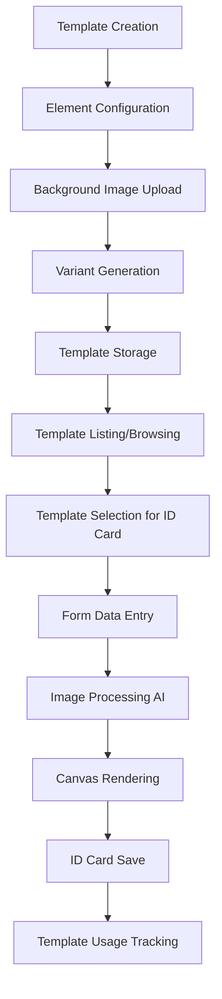
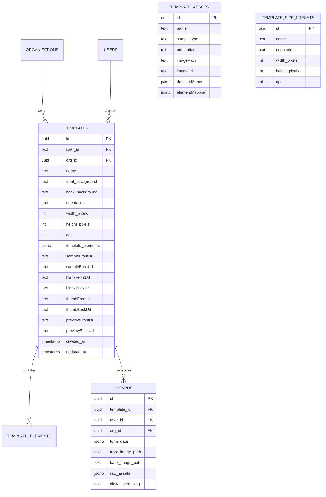
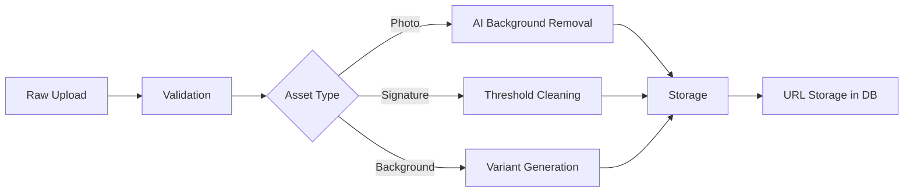

# Template System Assessment Report - PHASED IMPLEMENTATION PLAN

## Executive Summary

This report provides a comprehensive assessment of the template system in the ID Generator codebase, analyzing lifecycle management, inputs, display, outputs, database schema, and assets. The assessment identifies gaps and provides prioritized recommendations for improvements.

---

## CRITICAL BUG: Thumbnail Update Issue

### Problem Identified

When saving a template, thumbnails are **NOT** updating in the templates list page. This is a critical user-facing bug.

### Root Cause Analysis

**Location**: [`src/routes/(shell)/templates/+page.svelte`](src/routes/(shell)/templates/+page.svelte:1125-1185) - `refreshTemplatesList()` function

**Issue 1**: Cache-busting only applies to `front_background` and `back_background`, NOT to thumbnail URLs:
```typescript
// Line 1155-1158 - Only background URLs get cache busting
const normalized: DatabaseTemplate = {
  ...savedTemplate,
  front_background: addBuster(baseFront),
  back_background: addBuster(baseBack)
  // ❌ thumb_front_url, thumb_back_url NOT updated!
};
```

**Issue 2**: TemplateList component may be using cached thumbnail URLs from initial load instead of refreshed URLs from save response.

**Issue 3**: The `addBuster` function (line 1149-1154) doesn't apply to variant URLs:
```typescript
const addBuster = (url: string) => {
  if (!url) return '';
  if (url.startsWith('blob:') || url.startsWith('data:')) return url;
  const sep = url.includes('?') ? '&' : '?';
  return `${url}${sep}t=${timestamp}`;  // ❌ Only called for background, not thumbnails
};
```

### Fix Required

1. Apply cache-busting to all thumbnail/variant URLs in `refreshTemplatesList`:
```typescript
// Add to normalized object
thumb_front_url: savedTemplate.thumb_front_url ? `${savedTemplate.thumb_front_url}?t=${timestamp}` : null,
thumb_back_url: savedTemplate.thumb_back_url ? `${savedTemplate.thumb_back_url}?t=${timestamp}` : null,
preview_front_url: savedTemplate.preview_front_url ? `${savedTemplate.preview_front_url}?t=${timestamp}` : null,
preview_back_url: savedTemplate.preview_back_url ? `${savedTemplate.preview_back_url}?t=${timestamp}` : null,
```

2. Alternatively, force a page reload when thumbnails are critical (simpler but less smooth):
```typescript
// In saveTemplate, after successful save:
window.location.reload(); // Force refresh all cached thumbnails
```

---

## SAVE FLOW VERIFICATION

### ✅ What IS Working Correctly

1. **Database Save** (`+page.server.ts:194-204`):
   - Uses `INSERT ... ON CONFLICT DO UPDATE` pattern
   - Correctly handles both CREATE and UPDATE scenarios
   - All variant URLs saved: thumb, preview, blank, sample

2. **Server Response** - Returns complete saved template

3. **Client Response Handling** (`+page.svelte:821-841`)

---

### ⚠️ Potential Issues Found

| Issue | Location | Severity | Description |
|-------|----------|----------|-------------|
| **S-1** | `+page.server.ts:198` | Medium | `createdAt` overwritten on every save (loses original creation date) |
| **S-2** | `+page.server.ts:182` | Low | `updatedAt` in payload might conflict with server-set time |
| **S-3** | `+page.svelte:1164-1166` | Medium | Template list update might fail silently |

#### S-1: Created Date Overwrite Fix
```typescript
// Current (BUG):
createdAt: templateData.created_at ? new Date(templateData.created_at) : new Date()

// Fix: Only set createdAt if it's a new insert
const isNewTemplate = !templateData.id;
createdAt: isNewTemplate 
  ? (templateData.created_at ? new Date(templateData.created_at) : new Date())
  : undefined  // Let database keep existing value
```

---

## Immediate Action: Debug Save Issue

If templates are NOT saving, follow this checklist:

### 1. Check Browser Console for Errors
Look for:
- `[saveTemplate] Action result:` (line 819)
- `✅ Template saved and validated successfully` (line 965)
- `❌ Error saving template` (line 1104)

### 2. Check Network Tab
- POST to `?/create` - is it returning 200 or 500?
- Response body contains `success: true`?

### 3. Database Verification
```sql
SELECT id, name, created_at, updated_at 
FROM templates 
ORDER BY updated_at DESC 
LIMIT 10;
```

### 4. Quick Test: Force Page Reload
Temporary workaround - in `+page.svelte` line 1041, change to:
```typescript
// Instead of:
await refreshTemplatesList(normalizedForList as any);

// Use:
window.location.reload();
```

---

## Phased Implementation Plan

### Phase 1: Critical Bug Fixes (Week 1)

| Priority | Issue | File | Fix Description |
|----------|-------|------|-----------------|
| **P1-1** | Thumbnail cache issue | `templates/+page.svelte:1125-1185` | Apply cache-busting to thumbnail URLs in `refreshTemplatesList` |
| **P1-2** | Variable name uniqueness | `schema.ts` | Add unique constraint on template_id + variableName |
| **P1-3** | Template status field | `schema.ts` | Add `status` column (draft/published/archived) |

#### P1-1: Thumbnail Cache Fix (Highest Priority - User Blocking)
```typescript
// In refreshTemplatesList function, update all variant URLs:
const normalized: DatabaseTemplate = {
  ...savedTemplate,
  front_background: addBuster(baseFront),
  back_background: addBuster(baseBack),
  // Add cache-busting to ALL variant URLs
  thumb_front_url: savedTemplate.thumb_front_url 
    ? `${savedTemplate.thumb_front_url}?t=${timestamp}` 
    : null,
  thumb_back_url: savedTemplate.thumb_back_url 
    ? `${savedTemplate.thumb_back_url}?t=${timestamp}` 
    : null,
  preview_front_url: savedTemplate.preview_front_url 
    ? `${savedTemplate.preview_front_url}?t=${timestamp}` 
    : null,
  preview_back_url: savedTemplate.preview_back_url 
    ? `${savedTemplate.preview_back_url}?t=${timestamp}` 
    : null,
  sample_front_url: savedTemplate.sample_front_url 
    ? `${savedTemplate.sample_front_url}?t=${timestamp}` 
    : null,
  sample_back_url: savedTemplate.sample_back_url 
    ? `${savedTemplate.sample_back_url}?t=${timestamp}` 
    : null,
};
```

#### P1-2: Variable Name Uniqueness
```sql
-- Migration:
ALTER TABLE templates ADD COLUMN status TEXT DEFAULT 'draft' CHECK (status IN ('draft', 'published', 'archived'));

-- Create unique index for variable names per template:
CREATE UNIQUE INDEX idx_template_elements_unique_variable 
ON templates (id) 
WHERE template_elements @> '[{"variableName": "test"}]';  -- Partial index not supported

-- Alternative: Add validation in Zod schema:
const templateElementSchema = z.union([...]).refine(
  (elements) => {
    const variableNames = elements
      .filter(el => el.variableName)
      .map(el => el.variableName);
    return new Set(variableNames).size === variableNames.length;
  },
  { message: "Variable names must be unique within a template" }
);
```

---

### Phase 2: Core Infrastructure (Week 2-3)

| Priority | Issue | File | Fix Description |
|----------|-------|------|-----------------|
| **P2-1** | Soft delete support | `schema.ts` | Add `is_deleted` column with cascade |
| **P2-2** | Template versioning | `schema.ts` | Create `template_versions` table |
| **P2-3** | Asset cleanup job | `utils/storage.ts` | Scheduled cleanup for orphaned assets |

#### P2-1: Soft Delete Implementation
```sql
-- Migration:
ALTER TABLE templates ADD COLUMN is_deleted BOOLEAN DEFAULT FALSE;
ALTER TABLE template_assets ADD COLUMN is_deleted BOOLEAN DEFAULT FALSE;

-- Update queries to filter deleted:
-- Change WHERE clauses to include: AND is_deleted = FALSE
```

#### P2-2: Template Versioning
```sql
-- Create version history table:
CREATE TABLE template_versions (
  id UUID PRIMARY KEY DEFAULT gen_random_uuid(),
  template_id UUID REFERENCES templates(id) ON DELETE CASCADE,
  version_number INTEGER NOT NULL,
  template_elements JSONB NOT NULL,
  front_background TEXT,
  back_background TEXT,
  created_by TEXT,
  created_at TIMESTAMP WITH TIME ZONE DEFAULT NOW(),
  change_summary TEXT
);

CREATE INDEX idx_template_versions_template ON template_versions(template_id);
```

#### P2-3: Asset Cleanup Job
```typescript
// utils/assetCleanup.ts
export async function cleanupOrphanedAssets() {
  // Find all asset paths in storage
  // Compare with active templates and idcards
  // Delete assets not referenced
  // Log cleanup results
}

// Run as scheduled job (e.g., daily via cron or database trigger)
```

---

### Phase 3: User Experience (Week 4-5)

| Priority | Issue | File | Fix Description |
|----------|-------|------|-----------------|
| **P3-1** | PDF export | `utils/pdfExport.ts` | Add print-ready PDF generation |
| **P3-2** | Element overlap validation | `TemplateEdit.svelte` | Visual warning for overlapping elements |
| **P3-3** | Template tags/categories | `schema.ts` | Add tags column and filtering |

#### P3-1: PDF Export
```typescript
// utils/pdfExport.ts
import { jsPDF } from 'jspdf';

export async function generateTemplatePDF(template: DatabaseTemplate): Promise<Blob> {
  const doc = new jsPDF({
    orientation: template.orientation,
    unit: 'mm',
    format: [template.width_pixels * 25.4 / 300, template.height_pixels * 25.4 / 300]
  });
  
  // Add front background
  // Add rendered elements
  // Add crop marks for printing
  
  return doc.output('blob');
}
```

---

### Phase 4: Advanced Features (Week 6+)

| Priority | Issue | Description |
|----------|-------|-------------|
| **P4-1** | WYSIWYG editor | Real-time canvas-based template editing |
| **P4-2** | Template marketplace | Public sharing and ratings |
| **P4-3** | Bulk operations | CSV import, batch generation |
| **P4-4** | Accessibility | ARIA labels for canvas content |

---

## 2. Template System Architecture Overview

### 1.1 High-Level Architecture

```
┌─────────────────────────────────────────────────────────────────────────────┐
│                         Template System Architecture                         │
├─────────────────────────────────────────────────────────────────────────────┤
│                                                                             │
│  ┌─────────────┐    ┌─────────────────┐    ┌─────────────────────────────┐  │
│  │   User      │───▶│  Template Editor│───▶│  Template Storage           │  │
│  │             │    │  (TemplateForm) │    │  (R2/S3 Cloud Storage)      │  │
│  └─────────────┘    └─────────────────┘    └─────────────────────────────┘  │
│         │                    │                        │                      │
│         │                    │                        │                      │
│         ▼                    ▼                        ▼                      │
│  ┌─────────────┐    ┌─────────────────┐    ┌─────────────────────────────┐  │
│  │  Template   │◀───│   Database      │◀───│  Variant Generation         │  │
│  │  Browser    │    │  (Drizzle ORM)  │    │  (ImageProcessing)          │  │
│  └─────────────┘    └─────────────────┘    └─────────────────────────────┘  │
│         │                    │                        │                      │
│         │                    │                        │                      │
│         ▼                    ▼                        ▼                      │
│  ┌──────────────────────────────────────────────────────────────────────┐   │
│  │                    ID Card Generation Flow                            │   │
│  │  Template → Form Data → Canvas Render → Upload → ID Card Saved       │   │
│  └──────────────────────────────────────────────────────────────────────┘   │
│                                                                             │
└─────────────────────────────────────────────────────────────────────────────┘
```

### 1.2 Core Technology Stack

| Component | Technology | Purpose |
|-----------|------------|---------|
| Frontend | Svelte 5 (Runes) | Reactive UI components |
| Backend | SvelteKit (Node.js) | Server-side rendering & API |
| Database | PostgreSQL + Drizzle ORM | Relational data persistence |
| Storage | Cloudflare R2/S3 | File storage for templates & assets |
| Image Processing | HTML5 Canvas + Cloud APIs | Image manipulation & background removal |
| Validation | Zod | Schema validation |

---

## 2. Template Lifecycle Analysis

### 2.1 Current Lifecycle Flow



### 2.2 Lifecycle Stages Breakdown

| Stage | File(s) | Description |
|-------|---------|-------------|
| Creation | `TemplateForm.svelte` (2126 lines) | Drag-and-drop element editor with size presets |
| Storage | `src/lib/server/schema.ts` | Drizzle ORM schema with variant URLs |
| Variant Generation | `src/lib/utils/imageProcessing.ts` | Multi-resolution variant generation |
| Display | `IdCanvas.svelte` | Canvas-based real-time preview |
| ID Card Generation | `use-template/[id]/+page.svelte` (1966 lines) | Form-based ID card creation |
| Asset Management | `AssetUploadWizard.svelte` | Multi-step asset upload workflow |

### 2.3 Lifecycle Gaps Identified

| Gap ID | Description | Severity | Impact |
|--------|-------------|----------|--------|
| **LG-01** | No template versioning/history tracking | High | Cannot rollback or audit template changes |
| **LG-02** | No template deprecation workflow | Medium | Orphaned templates remain in system |
| **LG-03** | No template publishing/unpublishing mechanism | Medium | Templates always visible once created |
| **LG-04** | No template sharing between organizations | Low | Limits collaboration |
| **LG-05** | No template analytics/usage metrics | Low | No visibility into template performance |

---

## 3. Template Inputs Analysis

### 3.1 Input Types Supported

The system supports 7 distinct element types for template configuration:

| Element Type | Schema File | Input Method | AI Processing |
|--------------|-------------|--------------|---------------|
| Text | `template-element.schema.ts` | Text input field | ❌ |
| Image | `template-element.schema.ts` | File upload | ❌ |
| Photo | `template-element.schema.ts` | File upload + AI background removal | ✅ Cloud API |
| Signature | `template-element.schema.ts` | File upload + cleaning | ✅ Threshold/Crop |
| QR Code | `template-element.schema.ts` | Auto-generated from slug | ❌ |
| Selection | `template-element.schema.ts` | Dropdown select | ❌ |
| Graphic | `template-element.schema.ts` | Static decorative elements | ❌ |

### 3.2 Input Validation Schema

**Template Element Schema (Zod)**:
```typescript
// Discriminated union with type-specific schemas
templateElementSchema = z.union([
  textElementSchema,
  imageElementSchema, 
  qrElementSchema,
  photoElementSchema,
  signatureElementSchema,
  selectionElementSchema,
  graphicElementSchema
])

// Common fields across all elements
interface BaseElement {
  id: string;
  type: ElementType;
  variableName?: string;  // Unique identifier for form binding
  side: 'front' | 'back';
  x: number;              // Position X (pixels)
  y: number;              // Position Y (pixels)
  width: number;
  height: number;
}
```

### 3.3 Input Gaps Identified

| Gap ID | Description | Severity | Impact |
|--------|-------------|----------|--------|
| **IG-01** | No validation for variableName uniqueness within template | High | Form data collisions |
| **IG-02** | No validation for element overlap/collision | Medium | Elements may overlap on card |
| **IG-03** | No minimum/maximum size constraints per element type | Medium | Unusable element sizes |
| **IG-04** | No input validation for text element content (length, format) | Low | Data integrity issues |
| **IG-05** | No bulk field population from CSV/spreadsheet | Low | Manual data entry inefficiency |
| **IG-06** | No support for conditional elements based on selection | Low | Limited dynamic templating |
| **IG-07** | No support for barcodes (only QR codes) | Low | Limited identifier type support |

---

## 4. Template Display Analysis

### 4.1 Display Components

| Component | File | Purpose |
|-----------|------|---------|
| IdCanvas | `src/lib/components/IdCanvas.svelte` | Core canvas rendering engine |
| TemplateCard3D | `src/lib/components/TemplateCard3D.svelte` | 3D card preview with animations |
| TemplateBrowser | `src/lib/components/TemplateBrowser.svelte` | Grid/list view of templates |
| TemplateList | `src/lib/components/TemplateList.svelte` | Template listing component |
| TemplateEdit | `src/lib/components/TemplateEdit.svelte` | Inline template editor |
| IDCarousel3D | `src/lib/components/IDCarousel3D.svelte` | 3D carousel for ID cards |

### 4.2 Display Features

**Canvas Rendering Features**:
- Real-time preview with form data binding
- Dynamic element highlighting on focus
- Smart auto-flip based on input focus
- Zoom transformation for focused elements
- Responsive scaling for different screen sizes

**3D Card Features**:
- Animated card flipping
- Beat-responsive animations
- Tap/tilt interactions
- Multi-angle views

### 4.3 Display Gaps Identified

| Gap ID | Description | Severity | Impact |
|--------|-------------|----------|--------|
| **DG-01** | No WYSIWYG editor with live rendering | High | Editor doesn't match final output |
| **DG-02** | No print preview mode | Medium | Cannot preview before printing |
| **DG-03** | No accessibility features for canvas content | Medium | Screen readers cannot read card |
| **DG-04** | No dark mode specific rendering adjustments | Low | Colors may not display correctly |
| **DG-05** | No comparison view (side-by-side template versions) | Low | Cannot compare changes |
| **DG-06** | No AR/3D model export for physical printing | Low | Limited physical card output |

---

## 5. Template Outputs Analysis

### 5.1 Output Types

The system generates multiple output formats:

| Output Type | Format | Resolution | Purpose |
|-------------|--------|------------|---------|
| Full Resolution | PNG | Original (300 DPI) | Master file |
| Preview | JPEG | Max 800px | Web display |
| Thumbnail | JPEG | Max 200px | Grid view |
| Blank | PNG | Original | Overlay base |
| Sample | PNG/JPEG | Original | Template showcase |

### 5.2 Variant Configuration

```typescript
// From src/lib/utils/imageProcessing.ts
export const TEMPLATE_VARIANTS: ImageVariantConfig[] = [
  { variant: 'full', format: 'image/png' },
  { variant: 'preview', maxDimension: 800, quality: 0.85, format: 'image/jpeg' },
  { variant: 'thumb', maxDimension: 200, quality: 0.8, format: 'image/jpeg' }
];
```

### 5.3 Database Output Fields

```typescript
// Template table output URLs
sampleFrontUrl: text('sample_front_url'),
sampleBackUrl: text('sample_back_url'),
blankFrontUrl: text('blank_front_url'),
blankBackUrl: text('blank_back_url'),
thumbFrontUrl: text('thumb_front_url'),
thumbBackUrl: text('thumb_back_url'),
previewFrontUrl: text('preview_front_url'),
previewBackUrl: text('preview_back_url'),
```

### 5.4 Output Gaps Identified

| Gap ID | Description | Severity | Impact |
|--------|-------------|----------|--------|
| **OG-01** | No PDF export for print | High | Cannot print directly from system |
| **OG-02** | No bulk export for multiple ID cards | Medium | Manual individual exports |
| **OG-03** | No vector output (SVG) | Medium | Scalability limitations |
| **OG-04** | No watermark/overlay capability for sample outputs | Low | Template protection issues |
| **OG-05** | No configurable DPI for output | Low | Print quality may vary |
| **OG-06** | No batch template cloning to new cards | Low | Manual repetition |

---

## 6. Database Schema Analysis

### 6.1 Current Schema Structure

**Main Tables**:



### 6.2 Schema Relationships

| Relationship | Type | Description |
|--------------|------|-------------|
| Template → Organization | Many-to-One | Templates belong to orgs |
| Template → User | Many-to-One | Creator tracking |
| Template → ID Cards | One-to-Many | Cards generated from template |
| Template → Template Assets | One-to-Many | Asset decomposition |

### 6.3 Database Gaps Identified

| Gap ID | Description | Severity | Impact |
|--------|-------------|----------|--------|
| **DB-01** | No template status field (draft/published/archived) | High | Cannot manage template lifecycle |
| **DB-02** | No template versioning columns | High | No change history |
| **DB-03** | No template sharing/visibility settings | Medium | Cannot control template access |
| **DB-04** | No template tags/categories | Medium | Limited organization |
| **DB-05** | No soft delete (is_deleted column) | Medium | Cannot recover deleted templates |
| **DB-06** | No usage count on templates | Low | No popularity metrics |
| **DB-07** | No foreign key indexes on template_id | Low | Query performance |
| **DB-08** | No constraint on unique variableName per template | High | Data integrity risk |

---

## 7. Asset Management Analysis

### 7.1 Asset Types

| Asset Type | Storage | Purpose |
|------------|---------|---------|
| Background Images | R2/S3 templates/ | Template front/back backgrounds |
| Template Variants | R2/S3 templates/variants/ | Pre-rendered preview images |
| ID Card Photos | R2/S3 idcards/ | User uploaded photos |
| Signatures | R2/S3 signatures/ | Signature images |
| Processed Assets | R2/S3 processed/ | AI-processed images |

### 7.2 Asset Processing Pipeline



### 7.3 Asset Processing Functions

| Function | File | Purpose |
|----------|------|---------|
| `removeBackgroundCloud` | `imageProcessing.ts` | Runware API for background removal |
| `cleanSignature` | `imageProcessing.ts` | Local threshold-based cleaning |
| `generateTemplateVariants` | `imageProcessing.ts` | Multi-resolution generation |
| `getStorageUrl` | `storage.ts` | URL generation for assets |

### 7.4 Asset Management Gaps Identified

| Gap ID | Description | Severity | Impact |
|--------|-------------|----------|--------|
| **AG-01** | No asset versioning | Medium | Cannot revert asset changes |
| **AG-02** | No asset deduplication | Medium | Storage waste |
| **AG-03** | No asset compression optimization | Medium | Storage costs |
| **AG-04** | No asset metadata storage (EXIF, etc.) | Low | Missing asset info |
| **AG-05** | No CDN caching configuration | Low | Performance impact |
| **AG-06** | No asset cleanup for deleted templates | Medium | Orphaned files |
| **AG-07** | No asset permission management | Medium | Security risk |
| **AG-08** | No image format conversion (WebP support) | Low | Modern format support |

---

## 8. Integration Points

### 8.1 External Services

| Service | Purpose | Integration File |
|---------|---------|------------------|
| Cloudflare R2 | Object storage | `storage.ts` |
| Runware AI | Background removal | `imageProcessing.ts` |
| Supabase Auth | Authentication | `auth-client.ts` |
| PostgreSQL | Database | `schema.ts` |

### 8.2 Internal Module Dependencies

```
Template System Dependencies:
├── Authentication (auth-client.ts)
├── Database (schema.ts, db.ts)
├── Storage (storage.ts)
├── Image Processing (imageProcessing.ts)
├── Validation (schemas/template-element.schema.ts)
├── UI Components (TemplateForm.svelte, IdCanvas.svelte)
└── Pages (templates/, use-template/[id]/)
```

---

## 9. Priority Matrix

### 9.1 Gaps by Priority

**Critical (Should Fix)**:
| Gap ID | Area | Description |
|--------|------|-------------|
| DB-01 | Database | Template status field missing |
| DB-02 | Database | Template versioning missing |
| IG-01 | Input | Variable name uniqueness not enforced |
| LG-01 | Lifecycle | No versioning/history tracking |
| DB-08 | Database | Unique constraint on variableName |

**Important (Should Consider)**:
| Gap ID | Area | Description |
|--------|------|-------------|
| LG-03 | Lifecycle | No publish/unpublish mechanism |
| IG-02 | Input | No element overlap validation |
| DG-01 | Display | No WYSIWYG editor |
| OG-01 | Output | No PDF export |
| AG-02 | Assets | No asset deduplication |
| AG-06 | Assets | No orphaned asset cleanup |

**Nice to Have (Future Consideration)**:
| Gap ID | Area | Description |
|--------|------|-------------|
| DG-03 | Display | Accessibility features |
| LG-04 | Lifecycle | Template sharing |
| OG-03 | Output | Vector output |
| AG-08 | Assets | WebP conversion |

---

## 10. Recommendations

### 10.1 Immediate Actions (Sprint 1)

1. **Add Template Status Field**
   ```sql
   ALTER TABLE templates ADD COLUMN status TEXT DEFAULT 'draft' 
   CHECK (status IN ('draft', 'published', 'archived'));
   ```

2. **Add Variable Name Uniqueness Constraint**
   ```sql
   -- Create unique index on (template_id, variableName)
   CREATE UNIQUE INDEX idx_template_elements_variable_name 
   ON template_elements(template_id, variableName) 
   WHERE variableName IS NOT NULL;
   ```

3. **Implement Soft Delete**
   ```sql
   ALTER TABLE templates ADD COLUMN is_deleted BOOLEAN DEFAULT FALSE;
   ALTER TABLE template_assets ADD COLUMN is_deleted BOOLEAN DEFAULT FALSE;
   ```

### 10.2 Short-Term Improvements (Sprint 2-3)

1. **Template Versioning System**
   - Add `template_versions` table
   - Track changes with diff history
   - Implement rollback capability

2. **PDF Export Functionality**
   - Use `pdf-lib` or `jspdf` library
   - Generate print-ready PDF from canvas
   - Include crop marks and bleed area

3. **Asset Cleanup Job**
   - Scheduled job to remove orphaned assets
   - Template deletion triggers cascade cleanup
   - Soft delete with grace period

### 10.3 Long-Term Enhancements (Future Sprints)

1. **WYSIWYG Template Editor**
   - Real-time canvas-based editing
   - Drag-and-drop with snap-to-grid
   - Live validation feedback

2. **Template Marketplace**
   - Public template sharing
   - Template ratings/reviews
   - Featured templates

3. **Bulk Operations**
   - CSV import for card data
   - Batch card generation
   - Bulk template actions

---

## 11. Testing Requirements

### 11.1 Critical Test Cases

| Test Case | Description | Priority |
|-----------|-------------|----------|
| Variable name collision | Ensure unique variable names per template | Critical |
| Template deletion | Verify cascade cleanup of assets | Critical |
| Variant generation | Confirm all variants generated correctly | High |
| Canvas rendering | Validate element positioning accuracy | High |
| Form binding | Verify data binding to canvas elements | High |

### 11.2 Integration Tests

| Test | Scope |
|------|-------|
| Template → ID Card flow | End-to-end |
| Image processing pipeline | Unit |
| Database constraints | Integration |
| Asset storage/retrieval | Integration |

---

## 12. Security Considerations

### 12.1 Identified Security Gaps

| Gap ID | Issue | Mitigation |
|--------|-------|------------|
| Asset access | No per-asset permission checks | Implement asset-level access control |
| Template injection | No sanitization of template elements | Add input validation/sanitization |
| IDOR risk | Template access checks exist but need review | Continue defense-in-depth approach |

### 12.2 Security Best Practices

1. All template access is already protected by organization isolation
2. Pre-generated QR slugs prevent manipulation
3. Server-side validation for all form submissions

---

## Appendix A: File Reference Index

### A.1 Core Template Files

| File | Lines | Purpose |
|------|-------|---------|
| `src/routes/(shell)/templates/+page.svelte` | 2126 | Main template browser and editor |
| `src/routes/(shell)/use-template/[id]/+page.svelte` | 1966 | ID card generation page |
| `src/lib/components/TemplateForm.svelte` | 2126+ | Template element editor |
| `src/lib/components/IdCanvas.svelte` | ~800 | Canvas rendering component |
| `src/lib/server/schema.ts` | ~500 | Database schema definitions |

### A.2 Supporting Files

| File | Purpose |
|------|---------|
| `src/lib/schemas/template-element.schema.ts` | Zod validation schemas |
| `src/lib/utils/imageProcessing.ts` | Image processing pipeline |
| `src/lib/utils/storage.ts` | Cloud storage utilities |
| `src/lib/components/template-assets/AssetUploadWizard.svelte` | Asset upload workflow |

---

## Appendix B: Database Schema Files

### Migration Files Reference

| File | Purpose |
|------|---------|
| `drizzle/0000_lyrical_shinko_yamashiro.sql` | Initial schema |
| `drizzle/0001_mixed_longshot.sql` | Template elements |
| `drizzle/0002_add_template_assets_columns.sql` | Asset variant columns |
| `drizzle/meta/_journal.json` | Migration journal |

---

*Report generated: 2025-12-26*
*Assessment scope: Full template system analysis*
*Confidence level: High (based on code review)*
