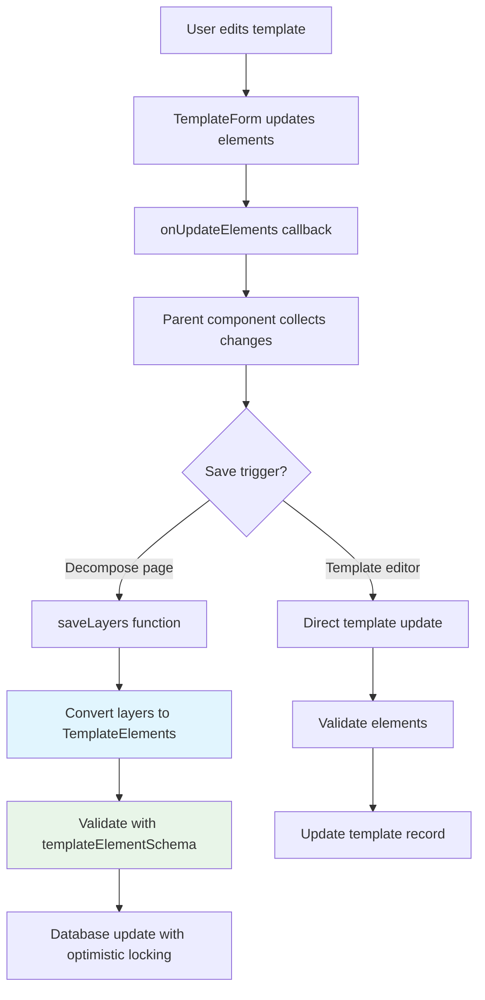

# Template Unit Tests Plan

## Overview
This plan outlines 2 unit tests for the crucial template creation and saving functionality in the app. The tests focus on validating template elements at the schema level and the layer-to-element conversion logic used when saving templates.

## Key Entry Points for Template Creation/Saving

### 1. TemplateForm.svelte (`src/lib/components/TemplateForm.svelte`)
- Manages front/back template element editing
- `onUpdateElements` callback propagates element changes
- Background image upload and position controls

### 2. TemplateEdit.svelte (`src/lib/components/TemplateEdit.svelte`)
- Wrapper component managing both front and back template forms
- Calls `onSave` callback when saving template

### 3. decompose.remote.ts (`src/lib/remote/decompose.remote.ts`)
- **`saveLayers()`** function: Saves decomposed layers as template elements
- Converts `LayerSelection[]` to `TemplateElement[]`
- Validates elements against `templateElementSchema`
- Updates template in database with optimistic locking

### 4. template-element.schema.ts (`src/lib/schemas/template-element.schema.ts`)
- Zod schema for validating all template element types
- Used to validate elements before saving

---

## Test 1: Template Element Schema Validation

**File:** `tests/unit/template-element-validation.test.ts`

### Purpose
Validate that the `templateElementSchema` correctly validates all template element types (text, image, qr, photo, signature, selection, graphic).

### Test Cases

| Test | Description | Expected Result |
|------|-------------|-----------------|
| Valid text element | Element with type 'text' and all required fields | Passes validation |
| Valid image element | Element with type 'image' and valid URL | Passes validation |
| Valid qr element | Element with type 'qr' and required properties | Passes validation |
| Valid photo element | Element with type 'photo' | Passes validation |
| Valid signature element | Element with type 'signature' | Passes validation |
| Valid selection element | Element with type 'selection' and options array | Passes validation |
| Valid graphic element | Element with type 'graphic' and valid URL | Passes validation |
| Invalid type | Element with unknown type | Fails with type error |
| Missing required id | Element without UUID id | Fails validation |
| Invalid variable name | Variable name with special characters | Fails validation |
| Negative position | Element with negative x or y | Fails validation |
| Invalid color | Element with invalid color format | Fails validation |
| Invalid URL | Image/graphic with malformed URL | Fails validation |
| Out of range font size | Font size > 200 or < 1 | Fails validation |
| Rotation out of range | Rotation < -180 or > 180 | Fails validation |

### Implementation Notes
- Use `templateElementSchema.safeParse()` for validation
- Test all element types defined in the schema
- Test edge cases for field validation rules

---

## Test 2: Layer to Template Element Conversion

**File:** `tests/unit/layer-to-element-conversion.test.ts`

### Purpose
Validate the logic that converts decomposed layers (`LayerSelection`) into template elements (`TemplateElement`). This is the core conversion logic used in `saveLayers()`.

### Key Conversion Logic (from decompose.remote.ts lines 470-542)

```typescript
const newElements: TemplateElement[] = includedLayers.map((layer) => {
  const baseElement = {
    id: crypto.randomUUID(),
    variableName: layer.variableName,
    x: layer.bounds.x,
    y: layer.bounds.y,
    width: layer.bounds.width,
    height: layer.bounds.height,
    rotation: 0,
    side: layer.side || 'front',
    visible: true,
    opacity: 1
  };

  switch (layer.elementType) {
    case 'image':
      return { ...baseElement, type: 'image' as const, src: layer.layerImageUrl!, fit: 'contain' as const };
    case 'text':
      return { ...baseElement, type: 'text' as const, content: '', fontSize: 14, fontFamily: 'Roboto', ... };
    case 'photo':
      return { ...baseElement, type: 'photo' as const, placeholder: 'Photo', aspectRatio: 'free' as const };
    case 'qr':
      return { ...baseElement, type: 'qr' as const, content: '', contentMode: 'custom' as const, ... };
    case 'signature':
      return { ...baseElement, type: 'signature' as const, placeholder: 'Signature', borderWidth: 1 };
    case 'graphic':
      return { ...baseElement, type: 'graphic' as const, src: layer.layerImageUrl!, fit: 'contain' as const, ... };
    default:
      return { ...baseElement, type: 'image' as const, src: layer.layerImageUrl || '', fit: 'contain' as const };
  }
});
```

### Test Cases

| Test | Description | Expected Result |
|------|-------------|-----------------|
| Image layer conversion | Layer with elementType='image' creates image element | Correct type, src, fit |
| Text layer conversion | Layer with elementType='text' creates text element | Correct type, default font props |
| Photo layer conversion | Layer with elementType='photo' creates photo element | Correct type, placeholder, aspectRatio |
| QR layer conversion | Layer with elementType='qr' creates qr element | Correct type, contentMode, errorCorrection |
| Signature layer conversion | Layer with elementType='signature' creates signature element | Correct type, placeholder, borderWidth |
| Graphic layer conversion | Layer with elementType='graphic' creates graphic element | Correct type, src, fit, maintainAspectRatio |
| Unknown type fallback | Layer with unknown elementType creates image element | Defaults to 'image' type |
| Side assignment | Layer with explicit side assignment | Element.side matches layer.side |
| Default side | Layer without side assignment | Element.side defaults to 'front' |
| UUID generation | Each converted element gets unique id | All ids are valid UUIDs |
| Bounds preservation | Layer bounds map to element x, y, width, height | Values preserved exactly |
| Visibility and opacity | Converted elements have visible=true, opacity=1 | Defaults applied |
| Rotation default | Converted elements have rotation=0 | Default value set |

### Implementation Notes
- Extract conversion logic into testable pure functions
- Mock `crypto.randomUUID()` for deterministic tests
- Test each element type conversion in isolation
- Verify schema validation passes after conversion

---

## Mermaid Diagram: Template Save Flow



---

## Test File Structure

```
tests/
├── unit/
│   ├── template-element-validation.test.ts      # Test 1
│   └── layer-to-element-conversion.test.ts      # Test 2
```

---

## Running the Tests

```bash
# Run unit tests
pnpm test:unit

# Run specific test file
pnpm vitest run tests/unit/template-element-validation.test.ts
```

---

## Dependencies & Setup

The tests use:
- **vitest** for test runner
- **@testing-library/jest-dom** for assertions
- **zod** for schema validation
- **crypto** for UUID generation

No external mocks required for schema validation tests. For conversion tests, mock `crypto.randomUUID()` for deterministic results.
