# Templates Page Refactoring Plan

## Overview
The templates page (`src/routes/(shell)/templates/+page.svelte`) is currently **2,237 lines** and contains multiple responsibilities that should be separated into smaller, more maintainable components and utilities.

## Current Structure Analysis

### State Management (Lines 100-246)
- **Template data**: `templates`, `user`, `org_id`, `currentTemplate`
- **Background handling**: `frontBackground`, `backBackground`, `frontPreview`, `backPreview`, `frontCropPreview`, `backCropPreview`
- **Elements**: `frontElements`, `backElements`
- **Editor state**: `isEditMode`, `isSaving`, `editorVersion`
- **Card dimensions**: `currentCardSize`, `requiredPixelDimensions`
- **Review modal**: `isReviewing`, `reviewSide`, `reviewRotation`, `isClosingReview`, `flyTarget`
- **Cropping**: `showCroppingDialog`, `pendingSave`, `croppingDialogData`
- **Background position**: `frontBackgroundPosition`, `backBackgroundPosition`
- **Drag optimization**: `isDraggingBackground`, `dragUpdateTimeout`, `lastPositionUpdateTime`, `positionUpdateCount`
- **Variant generation**: `isGeneratingVariants`, `variantGenerationProgress`
- **3D geometries**: `templateGeometries`, `readyModelsCount`, `totalTemplatesCount`

### Key Functions (Lines 14-1983)
1. **Image Upload** (lines 15-51): `uploadImage()`
2. **Orientation Detection** (lines 68-98): `detectOrientationFromDimensions()`, `getOrientationAwarePixelDimensions()`
3. **Blob Conversion** (lines 166-173): `blobToDataUrl()`
4. **Size Finding** (lines 377-445): `findBestDefaultSize()`
5. **Validation** (lines 447-485): `validateBackgrounds()`, `validateImage()`
6. **Background Fetching** (lines 491-528): `fetchBackgroundAsBlob()`
7. **Save Template** (lines 530-1215): `saveTemplate()` - **685 lines!**
8. **List Refresh** (lines 1220-1287): `refreshTemplatesList()`
9. **Cropping Dialog** (lines 1289-1418): `checkAndShowCroppingDialog()`, `handleCroppingConfirm()`, `handleCroppingCancel()`
10. **Image Upload Handler** (lines 1420-1451): `handleImageUpload()`
11. **Element Creation** (lines 1453-1494): `triggerElementCreation()`
12. **Background Position** (lines 1499-1540): `handleBackgroundPositionUpdate()`
13. **Crop Previews** (lines 1546-1619): `updateCropPreviews()`
14. **Remove Image** (lines 1621-1631): `handleRemoveImage()`
15. **Decompose** (lines 1637-1662): `handleDecompose()`
16. **Editor Initialization** (lines 1665-1787): `initializeEditor()`
17. **Template Selection** (lines 1789-1809): `handleTemplateSelect()`
18. **Element Updates** (lines 1811-1817): `updateElements()`
19. **Back Handler** (lines 1819-1829): `handleBack()`
20. **Form Clear** (lines 1831-1848): `clearForm()`
21. **New Template** (lines 1850-1923): `handleCreateNewTemplate()`
22. **Review Modal** (lines 248-295): `startReview()`, `cancelReview()`, `flipReview()`, `confirmAndSave()`

### Template Section (Lines 1986-2211)
- Main layout with grid
- TemplateList component
- TemplateEdit component
- CroppingConfirmationDialog component
- **Inline Review Modal** (lines 2057-2210) - **154 lines**

## Refactoring Strategy

### Phase 1: Extract Utility Functions
Create dedicated utility modules for reusable logic.

#### 1.1 Image Upload Utilities
**File**: `src/lib/utils/templateImageUpload.ts`
```typescript
// Functions to extract:
- uploadImage(file, path, userId)
- blobToDataUrl(fileOrBlob)
- fetchBackgroundAsBlob(url, side)
```

#### 1.2 Template Helpers
**File**: `src/lib/utils/templateHelpers.ts`
```typescript
// Functions to extract:
- detectOrientationFromDimensions(width, height)
- getOrientationAwarePixelDimensions(dims, expectedOrientation)
- findBestDefaultSize()
- validateBackgrounds()
- validateImage(file, side)
```

#### 1.3 Element Management
**File**: `src/lib/utils/templateElements.ts`
```typescript
// Functions to extract:
- triggerElementCreation()
- sanitizeElement(el)
- splitElementsBySide(elements)
```

#### 1.4 Background Position Helpers
**File**: `src/lib/utils/backgroundPosition.ts`
```typescript
// Functions to extract:
- handleBackgroundPositionUpdate(position, side)
- updateCropPreviews()
- Drag performance optimization logic
```

### Phase 2: Create Composable Hooks
Extract state management into reusable Svelte 5 runes/composables.

#### 2.1 Template Editor Hook
**File**: `src/lib/composables/useTemplateEditor.ts`
```typescript
// State to manage:
- currentTemplate
- isEditMode
- editorVersion
- currentCardSize
- requiredPixelDimensions
- frontElements, backElements
- errorMessage

// Functions:
- initializeEditor(templateData)
- handleTemplateSelect(id)
- handleBack()
- clearForm()
- handleCreateNewTemplate(cardSize, name, orientation, frontBackgroundUrl)
- updateElements(elements, side)
```

#### 2.2 Image Upload Hook
**File**: `src/lib/composables/useImageUpload.ts`
```typescript
// State to manage:
- frontBackground, backBackground
- frontPreview, backPreview
- frontCropPreview, backCropPreview
- frontBackgroundPosition, backBackgroundPosition
- isDraggingBackground
- dragUpdateTimeout
- lastPositionUpdateTime
- positionUpdateCount

// Functions:
- handleImageUpload(files, side)
- handleRemoveImage(side)
- handleBackgroundPositionUpdate(position, side)
- updateCropPreviews()
```

#### 2.3 Review Modal Hook
**File**: `src/lib/composables/useReviewModal.ts`
```typescript
// State to manage:
- isReviewing
- reviewSide
- reviewRotation
- isClosingReview
- flyTarget
- savingTemplateId
- isGeneratingVariants
- variantGenerationProgress

// Functions:
- startReview()
- cancelReview()
- flipReview()
- confirmAndSave()
```

#### 2.4 Cropping Dialog Hook
**File**: `src/lib/composables/useCroppingDialog.ts`
```typescript
// State to manage:
- showCroppingDialog
- pendingSave
- croppingDialogData

// Functions:
- checkAndShowCroppingDialog()
- handleCroppingConfirm()
- handleCroppingCancel()
```

#### 2.5 Template Save Hook
**File**: `src/lib/composables/useTemplateSave.ts`
```typescript
// State to manage:
- isSaving
- isLoading

// Functions:
- saveTemplate()
- refreshTemplatesList(savedTemplate)
```

### Phase 3: Extract Components
Create specialized UI components.

#### 3.1 Template Review Modal
**File**: `src/lib/components/TemplateReviewModal.svelte`
```svelte
<!-- Extract lines 2057-2210 -->
<!-- Props:
  - isOpen: boolean
  - frontCropPreview: string | null
  - backCropPreview: string | null
  - frontPreview: string | null
  - backPreview: string | null
  - frontElements: TemplateElement[]
  - backElements: TemplateElement[]
  - requiredPixelDimensions: { width: number; height: number }
  - currentTemplate: DatabaseTemplate | null
  - reviewSide: 'front' | 'back'
  - reviewRotation: number
  - isClosingReview: boolean
  - flyTarget: { top: number; left: number; width: number; height: number } | null
  - isGeneratingVariants: boolean
  - variantGenerationProgress: string

<!-- Events:
  - onFlip
  - onCancel
  - onConfirm
-->
```

#### 3.2 Template Editor Layout
**File**: `src/lib/components/TemplateEditorLayout.svelte`
```svelte
<!-- Extract the edit view overlay (lines 2007-2041) -->
<!-- Props:
  - editorVersion: number
  - isLoading: boolean
  - frontElements: TemplateElement[]
  - backElements: TemplateElement[]
  - frontPreview: string | null
  - backPreview: string | null
  - errorMessage: string
  - currentCardSize: CardSize | null
  - requiredPixelDimensions: { width: number; height: number } | null
  - isSuperAdmin: boolean
  - templateId: string | null
  - isDecomposing: boolean

<!-- Events:
  - onBack
  - onSave
  - onClear
  - onUpdateElements
  - onImageUpload
  - onRemoveImage
  - onUpdateBackgroundPosition
  - onDecompose
-->
```

#### 3.3 Template Actions Component
**File**: `src/lib/components/TemplateActions.svelte`
```svelte
<!-- Extract action buttons from review modal (lines 2167-2186) -->
<!-- Props:
  - isClosingReview: boolean
  - isGeneratingVariants: boolean
  - variantGenerationProgress: string

<!-- Events:
  - onCancel
  - onConfirm
-->
```

#### 3.4 Template Metadata Display
**File**: `src/lib/components/TemplateMetadata.svelte`
```svelte
<!-- Extract metadata display (lines 2189-2207) -->
<!-- Props:
  - currentTemplate: DatabaseTemplate | null
  - requiredPixelDimensions: { width: number; height: number }
  - frontElements: TemplateElement[]
  - backElements: TemplateElement[]
  - isGeneratingVariants: boolean
  - variantGenerationProgress: string
  - isClosingReview: boolean
-->
```

#### 3.5 3D Card Preview Component
**File**: `src/lib/components/TemplateCardPreview.svelte`
```svelte
<!-- Extract the 3D flip preview area (lines 2094-2164) -->
<!-- Props:
  - frontCropPreview: string | null
  - backCropPreview: string | null
  - frontPreview: string | null
  - backPreview: string | null
  - frontElements: TemplateElement[]
  - backElements: TemplateElement[]
  - requiredPixelDimensions: { width: number; height: number }
  - reviewSide: 'front' | 'back'
  - reviewRotation: number
  - isClosingReview: boolean
  - flyTarget: { top: number; left: number; width: number; height: number } | null

<!-- Events:
  - onFlip
-->
```

### Phase 4: Refactor Main Page
Simplify the main page by using extracted components and hooks.

#### 4.1 Simplified Page Structure
```svelte
<script lang="ts">
  // Import all hooks
  import { useTemplateEditor } from '$lib/composables/useTemplateEditor';
  import { useImageUpload } from '$lib/composables/useImageUpload';
  import { useReviewModal } from '$lib/composables/useReviewModal';
  import { useCroppingDialog } from '$lib/composables/useCroppingDialog';
  import { useTemplateSave } from '$lib/composables/useTemplateSave';

  // Import components
  import TemplateList from '$lib/components/TemplateList.svelte';
  import TemplateEditorLayout from '$lib/components/TemplateEditorLayout.svelte';
  import TemplateReviewModal from '$lib/components/TemplateReviewModal.svelte';
  import CroppingConfirmationDialog from '$lib/components/CroppingConfirmationDialog.svelte';

  // Initialize hooks
  const editor = useTemplateEditor({ data, templates, user, org_id });
  const imageUpload = useImageUpload({ currentTemplate: editor.currentTemplate });
  const reviewModal = useReviewModal({ 
    currentTemplate: editor.currentTemplate,
    frontPreview: imageUpload.frontPreview,
    backPreview: imageUpload.backPreview,
    frontElements: editor.frontElements,
    backElements: editor.backElements,
    requiredPixelDimensions: editor.requiredPixelDimensions,
    onSave: editor.saveTemplate
  });
  const croppingDialog = useCroppingDialog({ 
    frontBackground: imageUpload.frontBackground,
    backBackground: imageUpload.backBackground,
    requiredPixelDimensions: editor.requiredPixelDimensions,
    frontBackgroundPosition: imageUpload.frontBackgroundPosition,
    backBackgroundPosition: imageUpload.backBackgroundPosition
  });
  const templateSave = useTemplateSave({ 
    currentTemplate: editor.currentTemplate,
    frontBackground: imageUpload.frontBackground,
    backBackground: imageUpload.backBackground,
    frontPreview: imageUpload.frontPreview,
    backPreview: imageUpload.backPreview,
    frontElements: editor.frontElements,
    backElements: editor.backElements,
    requiredPixelDimensions: editor.requiredPixelDimensions,
    user,
    org_id,
    templates,
    onRefresh: editor.refreshTemplatesList
  });

  // Connect hooks together
  $effect(() => {
    // Sync state between hooks as needed
  });
</script>

<main class="h-full">
  <div class="grid grid-cols-1 grid-rows-1 w-full h-full overflow-hidden bg-background">
    <!-- Template List -->
    <div class="col-start-1 row-start-1 w-full h-full overflow-hidden {editor.isEditMode ? 'invisible pointer-events-none' : 'visible'}">
      <TemplateList
        bind:templates={editor.templates}
        onSelect={editor.handleTemplateSelect}
        onCreateNew={editor.handleCreateNewTemplate}
        savingTemplateId={templateSave.isSaving ? reviewModal.savingTemplateId : null}
        {sizePresets}
      />
    </div>

    <!-- Edit View -->
    {#if editor.isEditMode}
      <div class="col-start-1 row-start-1 z-10 w-full h-full bg-background animate-in fade-in slide-in-from-bottom-4 duration-300">
        <TemplateEditorLayout
          version={editor.editorVersion}
          isLoading={templateSave.isLoading}
          frontElements={editor.frontElements}
          backElements={editor.backElements}
          frontPreview={imageUpload.frontPreview}
          backPreview={imageUpload.backPreview}
          errorMessage={editor.errorMessage}
          cardSize={editor.currentCardSize}
          pixelDimensions={editor.requiredPixelDimensions}
          onBack={editor.handleBack}
          onSave={reviewModal.startReview}
          onClear={editor.clearForm}
          onUpdateElements={editor.updateElements}
          onImageUpload={imageUpload.handleImageUpload}
          onRemoveImage={imageUpload.handleRemoveImage}
          onUpdateBackgroundPosition={imageUpload.handleBackgroundPositionUpdate}
          isSuperAdmin={isSuperAdmin}
          templateId={editor.currentTemplate?.id ?? null}
          onDecompose={editor.handleDecompose}
          isDecomposing={editor.isDecomposing}
        />
      </div>
    {/if}
  </div>

  <!-- Cropping Dialog -->
  <CroppingConfirmationDialog
    bind:open={croppingDialog.showCroppingDialog}
    frontImageInfo={croppingDialog.croppingDialogData.front || null}
    backImageInfo={croppingDialog.croppingDialogData.back || null}
    templateSize={editor.requiredPixelDimensions || { width: LEGACY_CARD_SIZE.width, height: LEGACY_CARD_SIZE.height }}
    onConfirm={croppingDialog.handleCroppingConfirm}
    onCancel={croppingDialog.handleCroppingCancel}
  />

  <!-- Review Modal -->
  <TemplateReviewModal
    isOpen={reviewModal.isReviewing}
    frontCropPreview={imageUpload.frontCropPreview}
    backCropPreview={imageUpload.backCropPreview}
    frontPreview={imageUpload.frontPreview}
    backPreview={imageUpload.backPreview}
    frontElements={editor.frontElements}
    backElements={editor.backElements}
    requiredPixelDimensions={editor.requiredPixelDimensions}
    currentTemplate={editor.currentTemplate}
    reviewSide={reviewModal.reviewSide}
    reviewRotation={reviewModal.reviewRotation}
    isClosingReview={reviewModal.isClosingReview}
    flyTarget={reviewModal.flyTarget}
    isGeneratingVariants={templateSave.isGeneratingVariants}
    variantGenerationProgress={templateSave.variantGenerationProgress}
    onFlip={reviewModal.flipReview}
    onCancel={reviewModal.cancelReview}
    onConfirm={reviewModal.confirmAndSave}
  />
</main>
```

## Component Architecture Diagram

```mermaid
graph TB
    A[templates/+page.svelte] --> B[useTemplateEditor Hook]
    A --> C[useImageUpload Hook]
    A --> D[useReviewModal Hook]
    A --> E[useCroppingDialog Hook]
    A --> F[useTemplateSave Hook]
    
    A --> G[TemplateList Component]
    A --> H[TemplateEditorLayout Component]
    A --> I[TemplateReviewModal Component]
    A --> J[CroppingConfirmationDialog]
    
    H --> K[TemplateEdit Component]
    I --> L[TemplateCardPreview Component]
    I --> M[TemplateActions Component]
    I --> N[TemplateMetadata Component]
    
    B --> O[templateHelpers.ts]
    C --> P[templateImageUpload.ts]
    C --> Q[backgroundPosition.ts]
    B --> R[templateElements.ts]
    F --> S[templateSaveHelpers.ts]
    
    style A fill:#e1f5ff
    style B fill:#fff4e1
    style C fill:#fff4e1
    style D fill:#fff4e1
    style E fill:#fff4e1
    style F fill:#fff4e1
    style G fill:#e8f5e9
    style H fill:#e8f5e9
    style I fill:#e8f5e9
    style J fill:#e8f5e9
    style K fill:#f3e5f5
    style L fill:#f3e5f5
    style M fill:#f3e5f5
    style N fill:#f3e5f5
    style O fill:#fce4ec
    style P fill:#fce4ec
    style Q fill:#fce4ec
    style R fill:#fce4ec
    style S fill:#fce4ec
```



## File Structure After Refactoring

```
src/
├── lib/
│   ├── components/
│   │   ├── TemplateReviewModal.svelte          [NEW]
│   │   ├── TemplateEditorLayout.svelte         [NEW]
│   │   ├── TemplateCardPreview.svelte          [NEW]
│   │   ├── TemplateActions.svelte              [NEW]
│   │   ├── TemplateMetadata.svelte             [NEW]
│   │   ├── TemplateList.svelte                 [EXISTING]
│   │   ├── TemplateEdit.svelte                 [EXISTING]
│   │   └── CroppingConfirmationDialog.svelte   [EXISTING]
│   ├── composables/
│   │   ├── useTemplateEditor.ts                [NEW]
│   │   ├── useImageUpload.ts                   [NEW]
│   │   ├── useReviewModal.ts                   [NEW]
│   │   ├── useCroppingDialog.ts                [NEW]
│   │   └── useTemplateSave.ts                  [NEW]
│   └── utils/
│       ├── templateImageUpload.ts              [NEW]
│       ├── templateHelpers.ts                  [NEW]
│       ├── templateElements.ts                 [NEW]
│       ├── backgroundPosition.ts               [NEW]
│       └── templateSaveHelpers.ts              [NEW]
└── routes/
    └── (shell)/
        └── templates/
            └── +page.svelte                    [REFACTORED ~300 lines]
```

## Benefits of This Refactoring

### 1. **Maintainability**
- Each component/hook has a single responsibility
- Easier to locate and fix bugs
- Clear separation of concerns

### 2. **Reusability**
- Hooks can be reused in other pages (e.g., template editing in admin panel)
- Components can be used in different contexts
- Utility functions are testable in isolation

### 3. **Testability**
- Each hook can be tested independently
- Components can be unit tested with props
- Utility functions are pure functions (easier to test)

### 4. **Performance**
- Smaller components enable better code splitting
- Hooks can optimize re-renders with fine-grained reactivity
- Lazy loading of review modal components

### 5. **Developer Experience**
- Smaller files are easier to navigate
- Clear interfaces between components
- Better IDE support with smaller files

### 6. **Scalability**
- Easy to add new features to specific hooks
- Can extend components without affecting others
- Better support for team collaboration

## Implementation Order

### Step 1: Extract Utilities (Low Risk)
1. Create `templateImageUpload.ts` - extract image upload functions
2. Create `templateHelpers.ts` - extract helper functions
3. Create `templateElements.ts` - extract element management
4. Create `backgroundPosition.ts` - extract position handling
5. Test each utility module independently

### Step 2: Create Hooks (Medium Risk)
1. Create `useImageUpload.ts` - simplest hook, no dependencies
2. Create `useCroppingDialog.ts` - self-contained logic
3. Create `useReviewModal.ts` - isolated modal state
4. Create `useTemplateEditor.ts` - core editor logic
5. Create `useTemplateSave.ts` - complex save logic
6. Test each hook with unit tests

### Step 3: Extract Components (Medium Risk)
1. Create `TemplateCardPreview.svelte` - isolated preview component
2. Create `TemplateActions.svelte` - simple button component
3. Create `TemplateMetadata.svelte` - display component
4. Create `TemplateReviewModal.svelte` - compose above components
5. Create `TemplateEditorLayout.svelte` - wrapper for TemplateEdit
6. Test each component visually

### Step 4: Refactor Main Page (High Risk)
1. Replace inline review modal with `TemplateReviewModal` component
2. Replace edit view overlay with `TemplateEditorLayout` component
3. Integrate hooks one by one
4. Test full user flow
5. Remove old code

### Step 5: Cleanup and Documentation
1. Remove unused code
2. Add JSDoc comments to all functions
3. Create README for new components
4. Update any related documentation

## Testing Strategy

### Unit Tests
- Test all utility functions
- Test hook logic with mock dependencies
- Test component rendering with different props

### Integration Tests
- Test hook interactions
- Test component composition
- Test data flow between hooks

### E2E Tests
- Test complete user flows:
  - Create new template
  - Edit existing template
  - Upload images
  - Save template
  - Review template
  - Crop images

## Migration Notes

### Breaking Changes
- None expected if done incrementally
- All existing functionality should be preserved

### Backward Compatibility
- Keep existing component interfaces
- Gradually migrate to new structure
- Can run old and new code side-by-side during migration

### Performance Considerations
- Monitor bundle size impact
- Use dynamic imports for large components
- Optimize hook reactivity to prevent unnecessary re-renders

## Success Criteria

1. ✅ Main page reduced from 2,237 lines to ~300 lines
2. ✅ All components have < 200 lines
3. ✅ All hooks have < 150 lines
4. ✅ All utility functions are pure and testable
5. ✅ No functionality is lost
6. ✅ Code is well-documented
7. ✅ Tests pass for all new modules
8. ✅ Performance is maintained or improved

## Risks and Mitigations

### Risk 1: State Management Complexity
**Mitigation**: Use Svelte 5 runes for fine-grained reactivity, document state flow clearly

### Risk 2: Prop Drilling
**Mitigation**: Use context or stores where appropriate, keep component hierarchy shallow

### Risk 3: Breaking Existing Functionality
**Mitigation**: Incremental refactoring, comprehensive testing at each step

### Risk 4: Performance Regression
**Mitigation**: Profile before and after, optimize hot paths, use memoization

### Risk 5: Increased Bundle Size
**Mitigation**: Code splitting, tree shaking, lazy loading of modals

## Next Steps

1. Review and approve this plan
2. Create utility modules (Phase 1)
3. Create composable hooks (Phase 2)
4. Extract components (Phase 3)
5. Refactor main page (Phase 4)
6. Test and document (Phase 5)
