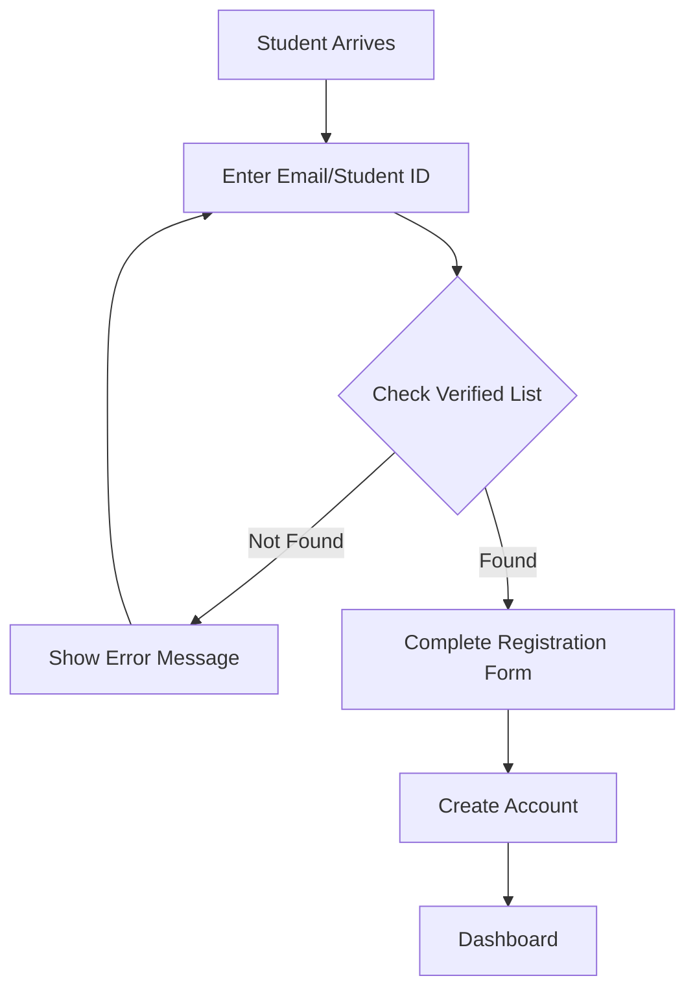
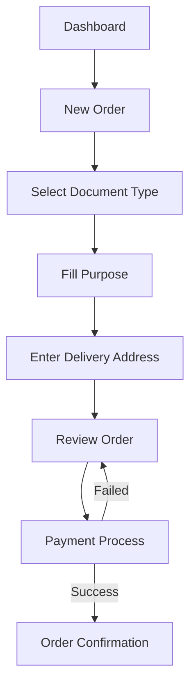
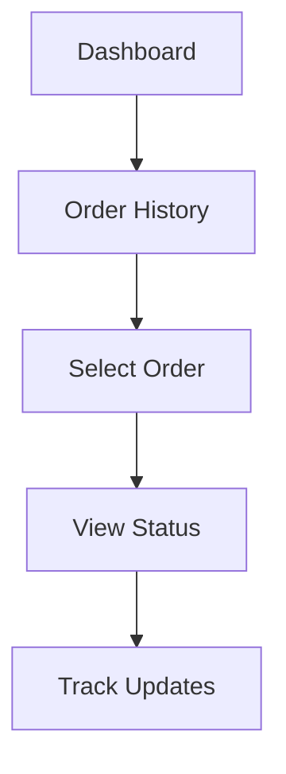
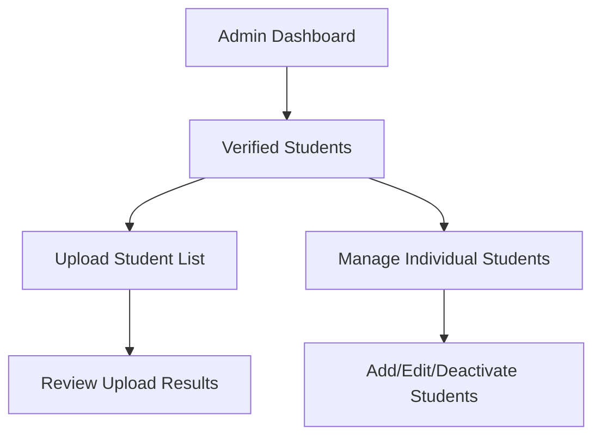
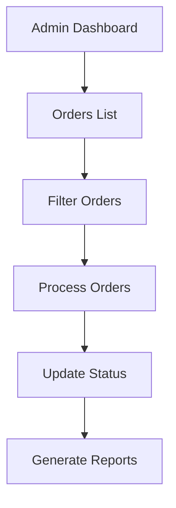
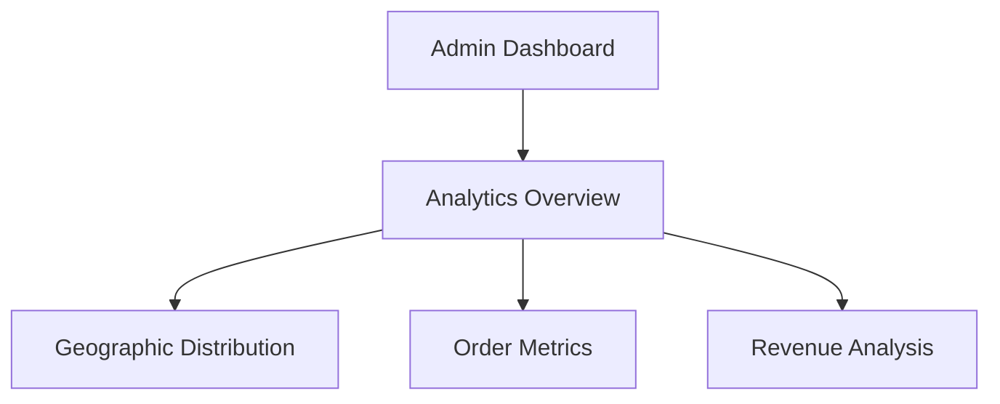

# User Flow Documentation

## Student User Flow

### 1. Registration & Verification

#### Details:
1. Student arrives at registration page
2. Enters email or student ID for verification
3. System checks against verified_students table
4. If verified:
   - Shows registration form pre-filled with verified data
   - Student adds password
   - Creates account
5. If not verified:
   - Shows error message
   - Directs to contact admin

### 2. Order Creation Flow

#### Details:
1. From dashboard, select "New Order"
2. Choose document type from available options
3. Fill in purpose of request
4. Enter/select delivery address
5. Review order details and total amount
6. Process payment via GCash
7. Receive order confirmation and tracking number

### 3. Order Tracking Flow

#### Details:
1. Access order history from dashboard
2. View list of all orders with basic status
3. Select specific order for details
4. Track current status and history
5. View estimated completion time

## Administrative User Flow

### 1. Student Verification Management

#### Details:
1. Access verified students section
2. Options to:
   - Bulk upload student list via CSV
   - Manually add individual students
   - Edit existing student records
   - Deactivate student records

### 2. Order Management Flow

#### Details:
1. View all orders in system
2. Filter by:
   - Status
   - Date range
   - Document type
3. Process individual orders:
   - Review details
   - Update status
   - Add tracking information
4. Generate reports

### 3. Analytics Dashboard Flow

#### Details:
1. Access analytics dashboard
2. View key metrics:
   - Total orders
   - Revenue
   - Processing times
3. Analyze geographic distribution
4. Review document type popularity

## System States and Notifications

### Order Status States
1. `pending` - Order created, awaiting payment
2. `paid` - Payment received
3. `processing` - Document being prepared
4. `ready` - Ready for shipping
5. `shipped` - In transit
6. `delivered` - Order completed
7. `cancelled` - Order cancelled

### Notification Points
1. Student Notifications:
   - Registration confirmation
   - Order confirmation
   - Payment confirmation
   - Status updates
   - Delivery confirmation

2. Admin Notifications:
   - New order alerts
   - Payment confirmations
   - Bulk upload completions
   - Status update confirmations

## Error Handling Flows

### Registration Errors
1. Student not in verified list:
   - Show error message
   - Provide admin contact information
   - Option to try different email/ID

### Payment Errors
1. Failed payment:
   - Show error details
   - Option to retry
   - Alternative payment methods

### Order Processing Errors
1. Invalid address:
   - Prompt for correction
   - Save valid addresses for future

## Data Validation Points

### Student Registration
- Email format validation
- Student ID format check
- Password strength requirements
- Phone number format

### Order Creation
- Valid delivery address
- Document type availability
- Purpose field requirements
- Payment amount validation

### Admin Operations
- CSV format validation
- Status update validations
- Report generation parameters