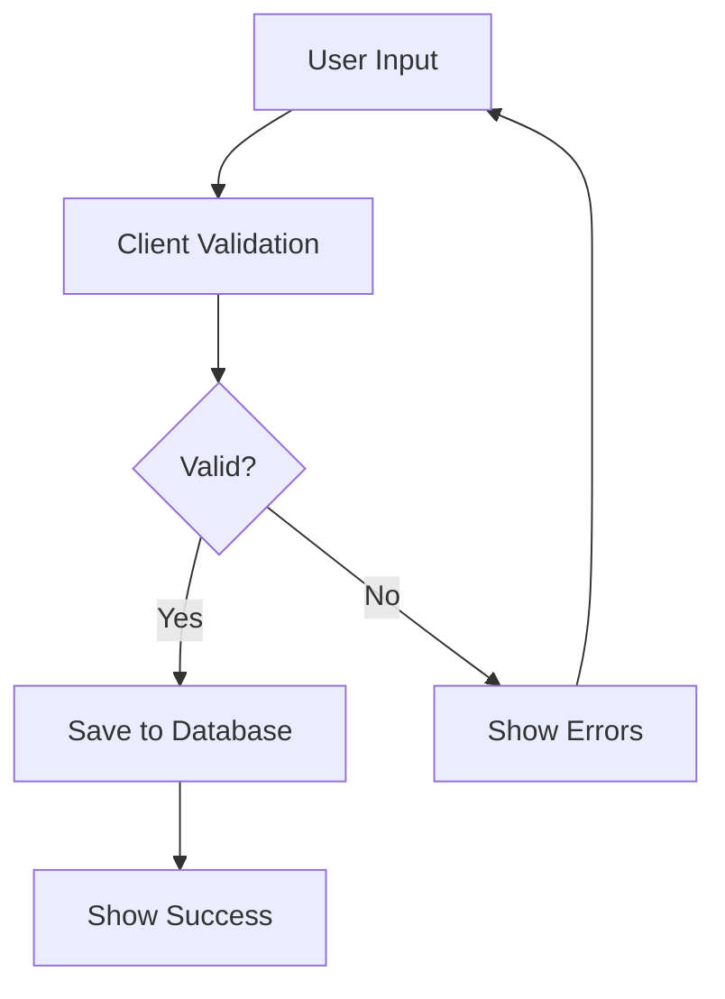

# Meter Readings Module Instructions

## Overview
The Meter Readings module is a critical component of the dormitory management system that handles utility consumption tracking. It enables staff to record and monitor readings for electricity, water, and internet meters across all properties.

## Database Schema

### Meters Table
```sql
CREATE TABLE public.meters (
    id integer NOT NULL DEFAULT nextval('meters_id_seq'::regclass),
    name text NOT NULL,
    location_type meter_location_type NOT NULL,
    property_id integer,
    floor_id integer,
    rental_unit_id integer,
    type utility_type NOT NULL,
    is_active boolean DEFAULT true,
    status meter_status NOT NULL DEFAULT 'ACTIVE',
    initial_reading numeric(10,2) NOT NULL DEFAULT 0,
    unit_rate numeric(10,2) NOT NULL DEFAULT 0,
    notes text,
    created_at timestamp with time zone NOT NULL DEFAULT timezone('utc'::text, now())
);
```

### Readings Table
```sql
CREATE TABLE public.readings (
    id integer NOT NULL DEFAULT nextval('readings_id_seq'::regclass),
    meter_id integer NOT NULL,
    reading numeric(10,2) NOT NULL,
    reading_date date NOT NULL,
    created_at timestamp with time zone NOT NULL DEFAULT timezone('utc'::text, now())
);
```

## Enums Used

### meter_location_type
- PROPERTY
- FLOOR
- RENTAL_UNIT

### meter_status
- ACTIVE
- INACTIVE
- MAINTENANCE

### utility_type
- ELECTRICITY
- WATER
- INTERNET

## Access Control

### User Roles
1. **Admin Access** (Full access)
   - super_admin
   - property_admin
   - property_manager

2. **Staff Access** (Create/Edit access)
   - property_maintenance
   - property_utility
   - property_frontdesk

3. **View Only Access**
   - property_tenant
   - property_guest

## Core Features

### 1. Meter Management
- Track utility types (ELECTRICITY, WATER, INTERNET)
- Maintain meter status (ACTIVE, INACTIVE, MAINTENANCE)
- Support different location types (PROPERTY, FLOOR, RENTAL_UNIT)
- Track initial readings and unit rates

### 2. Reading Records
- Record utility consumption readings with precision (numeric(10,2))
- Track reading history with timestamps
- Associate readings with specific meters
- Record reading dates for chronological tracking

### 3. Data Validation
- **Date Validation**
  - Must be on or after the latest reading date
  - Cannot be in the future
- **Reading Validation**
  - Must be greater than or equal to previous reading
  - Must be non-negative
  - Support decimal precision up to 2 places

## Data Input Flow

### User Input Sequence
1. **Select Filters**
   - Choose Utility Type (ELECTRICITY/WATER/INTERNET)
   - Choose Location Type (PROPERTY/FLOOR/RENTAL_UNIT)
   - System filters and displays relevant meters

2. **Enter Reading Details**
   - Input Reading Date
     - Must be after latest reading
     - Cannot be in future
   - For each meter:
     - Enter reading value
     - Must be ≥ previous reading
     - Must have max 2 decimal places

3. **Validation & Submission**
   - Client-side validation runs
   - If valid: Save to database
   - If invalid: Show error messages

### Data Flow


## Implementation Details

### Required Files
1. **+page.server.ts**
   - Handle data loading and form actions
   - Implement access control
   - Manage database operations

2. **+page.svelte**
   - Render user interface
   - Handle form interactions
   - Manage client-side state

3. **schema.ts**
   - Define database types and enums
   - Implement validation schemas
   - Export type definitions

4. **formSchema.ts**
   - Define form validation rules
   - Handle form state management
   - Implement custom validation logic

### Form Implementation
```typescript
import { z } from 'zod';
import type { meter_location_type, meter_status, utility_type } from '$lib/schema/types';

// Form schema with validation
const readingFormSchema = z.object({
  reading_date: z.string().min(1, 'Reading date is required'),
  meter_type: z.custom<utility_type>(),
  location_type: z.custom<meter_location_type>(),
  readings: z.array(
    z.object({
      meter_id: z.number(),
      reading_value: z.number().multipleOf(0.01).min(0)
    })
  )
});
```

### Required Components
1. **Meter Type Selection**
   - Dropdown for utility type selection
   - Location type selection
   - Filters relevant meters based on selection

2. **Reading Entry Form**
   - Date picker for reading date
   - Input fields for reading values (supporting decimals)
   - Validation feedback

3. **Progress Indicators**
   - Loading states
   - Submission progress
   - Success/error notifications

## User Interface Guidelines

### Layout
1. **Header Section**
   - Title
   - Permission status indicator
   - Action buttons

2. **Filter Section**
   - Meter type selection (ELECTRICITY/WATER/INTERNET)
   - Location type filter (PROPERTY/FLOOR/RENTAL_UNIT)
   - Date selection

3. **Reading Entry Section**
   - Grouped by location hierarchy
   - Display initial readings and unit rates
   - Show meter status and activity state
   - Clear input labels
   - Validation feedback

### Error Handling
1. **Validation Errors**
   - Display inline error messages
   - Highlight invalid fields
   - Show toast notifications for form-level errors

2. **Server Errors**
   - Display user-friendly error messages
   - Provide retry options
   - Maintain form state on error

## Best Practices

### 1. Data Entry
- Validate readings against initial_reading
- Support decimal input with proper formatting
- Show unit rates for reference
- Provide clear feedback for invalid entries

### 2. Performance
- Implement pagination for large datasets
- Cache frequently accessed data
- Optimize database queries

### 3. Security
- Validate all user input
- Implement proper access control
- Maintain audit trail of changes

## API Endpoints

### GET /dorm/readings
- Load meter data and previous readings
- Filter by utility type, location type, and date range
- Return hierarchical data structure

### POST /dorm/readings?/create
- Create new reading records
- Validate input data
- Return success/error status

## Testing Guidelines

### Unit Tests
1. **Validation Tests**
   - Test date validation rules
   - Test reading value validation (including decimals)
   - Test permission checks
   - Test enum validations

2. **Form Tests**
   - Test form submission
   - Test error handling
   - Test state management
   - Test enum selections

### Integration Tests
1. **API Tests**
   - Test endpoint responses
   - Test data persistence
   - Test error scenarios
   - Test role-based access

2. **UI Tests**
   - Test user interactions
   - Test form submissions
   - Test error displays
   - Test enum selections

## Deployment Considerations

### 1. Database
- Index frequently queried columns (meter_id, reading_date)
- Implement proper constraints
- Set up backup procedures
- Maintain enum integrity

### 2. Performance
- Implement caching where appropriate
- Optimize large queries
- Monitor system performance

### 3. Security
- Implement rate limiting
- Validate all inputs
- Log security events
- Enforce role-based access
