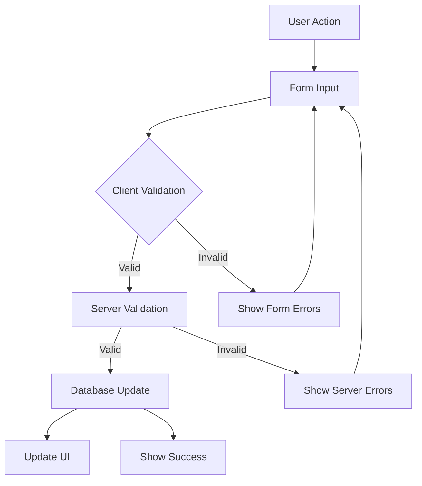

np# Room Management Module Instructions

## Overview
The Room Management module is a core component of the dormitory management system that handles room operations and tracking. It enables staff to create, update, and manage rooms across different properties and floors, including their status, capacity, and rates.

## Database Schema

### Rooms Table
```sql
CREATE TABLE public.rooms (
    id integer NOT NULL DEFAULT nextval('locations_id_seq'::regclass),
    name text NOT NULL,
    number integer NOT NULL,
    capacity integer NOT NULL,
    room_status location_status NOT NULL DEFAULT 'VACANT',
    base_rate numeric(10,2) NOT NULL,
    created_at timestamp with time zone NOT NULL DEFAULT timezone('utc'::text, now()),
    updated_at timestamp with time zone,
    property_id integer NOT NULL,
    floor_id integer NOT NULL,
    type text NOT NULL,
    amenities jsonb DEFAULT '{}'
);
```

### Related Tables

#### Properties Table (Reference)
```sql
CREATE TABLE public.properties (
    id integer NOT NULL DEFAULT nextval('properties_id_seq'::regclass),
    name text NOT NULL,
    address text NOT NULL,
    type text NOT NULL,
    status property_status NOT NULL DEFAULT 'ACTIVE',
    created_at timestamp with time zone NOT NULL DEFAULT timezone('utc'::text, now()),
    updated_at timestamp with time zone
);
```

#### Floors Table (Reference)
```sql
CREATE TABLE public.floors (
    id integer NOT NULL DEFAULT nextval('floors_id_seq'::regclass),
    property_id integer NOT NULL,
    floor_number integer NOT NULL,
    wing text,
    status floor_status NOT NULL DEFAULT 'ACTIVE',
    created_at timestamp with time zone NOT NULL DEFAULT timezone('utc'::text, now()),
    updated_at timestamp with time zone
);
```

## Enums Used

### location_status (room_status)
- VACANT
- OCCUPIED
- RESERVED

### property_status
- ACTIVE
- INACTIVE
- MAINTENANCE

### floor_status
- ACTIVE
- INACTIVE
- MAINTENANCE

## Access Control

### User Roles
1. **Admin Access** (Full access)
   - super_admin
   - property_admin
   - property_manager
   - property_accountant

2. **Staff Access** (Create/Edit access)
   - property_maintenance
   - property_utility
   - property_frontdesk

3. **View Only Access**
   - property_tenant
   - property_guest

### Access Level Permissions
- **Admin**: Full CRUD operations on rooms
- **Staff**: Create and update room information
- **View**: Read-only access to room information

## Core Features

### 1. Room Management
- Create new rooms with required details
- Update existing room information
- Delete rooms (with proper validation)
- Track room status changes

### 2. Room Properties
- Room number assignment
- Capacity configuration
- Base rate setting
- Amenities tracking
- Status management

### 3. Location Hierarchy
- Property association
- Floor assignment
- Wing specification (optional)

### 4. Data Validation
- **Room Number**
  - Must be unique within a floor
  - Required field
- **Capacity**
  - Must be at least 1
  - Required field
- **Base Rate**
  - Must be non-negative
  - Support decimal precision (10,2)
- **Status**
  - Must be one of the defined enum values

## Data Input Flow

### User Input Sequence
1. **Select Room Action**
   - Create new room
   - Edit existing room
   - View room details

2. **Enter Room Details**
   - Property selection
   - Floor selection
   - Room information:
     - Name
     - Number
     - Type
     - Capacity
     - Base rate
     - Status
     - Amenities

3. **Validation & Submission**
   - Client-side validation
   - Server-side validation
   - Database update

### Data Flow


## Implementation Details

### Required Files
1. **+page.server.ts**
   - Load room data with relations
   - Handle form actions:
     - Create room
     - Update room
     - Delete room
   - Validate input data
   - Manage database operations

2. **+page.svelte**
   - Display room list
   - Handle room selection
   - Manage edit/create modes
   - Status indicators

3. **RoomForm.svelte**
   - Form input fields
   - Validation feedback
   - Property/Floor selection
   - Status management

4. **formSchema.ts**
   - Form validation rules
   - Type definitions
   - Status enums

### Form Implementation
```typescript
const roomSchema = z.object({
  id: z.number().optional(),
  property_id: z.number(),
  floor_id: z.number(),
  name: z.string().min(1, 'Room name is required'),
  number: z.number().min(1, 'Room number is required'),
  room_status: z.enum(['VACANT', 'OCCUPIED', 'RESERVED']),
  capacity: z.number().min(1, 'Capacity must be at least 1'),
  base_rate: z.number().min(0, 'Rate must be 0 or greater'),
  type: z.string().min(1, 'Room type is required'),
  amenities: z.array(z.string()).default([])
});
```

## Performance Considerations
1. Use proper indexing on:
   - property_id
   - floor_id
   - room_number
2. Implement efficient filtering and sorting
3. Cache frequently accessed room data

## Security Considerations
1. Validate all user inputs
2. Implement proper access control
3. Sanitize data before display
4. Log all room status changes
